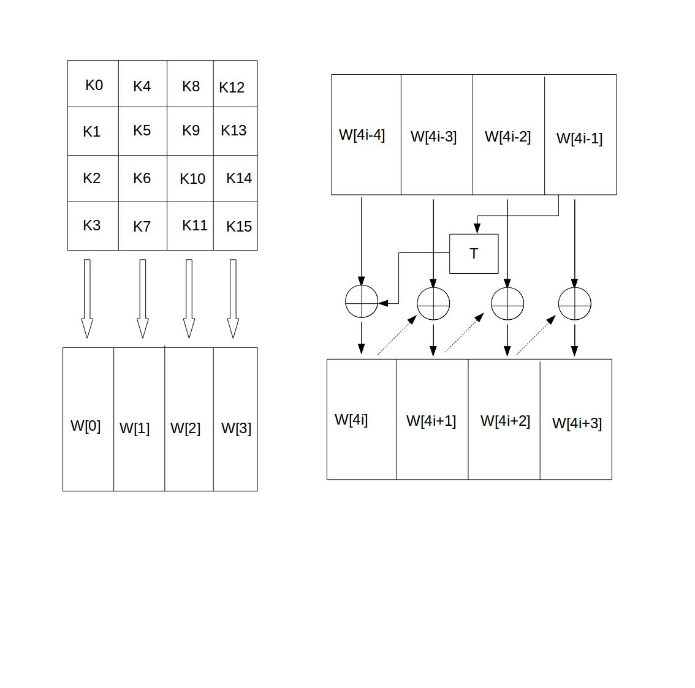

# AES

## AES的基本结构

AES为分组密码，分组密码也就是把明文分成一组一组的，每组长度相等，每次加密一组数据，直到加密完整个明文。在AES标准规范中，分组长度只能是128位，也就是说，每个分组为16个字节（每个字节8位）。密钥的长度可以使用128位、192位或256位。密钥的长度不同，推荐加密轮数也不同，如下表所示：

|AES|密钥长度（32位比特字)|分组长度(32位比特字)|加密轮数|
|-|-|-|-|
|AES-128|4|4|10|
|AES-192|6|4|12|
|AES-256|8|4|14|
轮数在下面介绍，这里实现的是`AES-128`，也就是密钥的长度为`128`位，加密轮数为`10`轮。
上面说到，AES的加密公式为`C = E(K,P)`，在**加密函数E中，会执行一个轮函数，并且执行10次这个轮函数**，这个轮函数的**前9次执行的操作是一样的，只有第10次有所不同**。也就是说，一个明文分组会被加密10轮。AES的核心就是实现一轮中的所有操作。

AES的处理单位是**字节**，`128`位的输入明文分组P和输入密钥K都被分成`16`个字节，分别记为`P = P0 P1 … P15` 和 `K = K0 K1 … K15`。如，明文分组为`P = abcdefghijklmnop`,其中的字符**a对应P0，p对应P15**。一般地，**明文分组用字节为单位的正方形矩阵描述，称为状态矩阵**。在算法的每一轮中，状态矩阵的内容不断发生变化，最后的结果作为密文输出。**该矩阵中字节的排列顺序为从上到下、从左至右依次排列**，如下图所示：


现在假设明文分组P为"`abcdefghijklmnop`"，则对应上面生成的状态矩阵图如下：


上图中，0x61为字符a的十六进制表示。可以看到，明文经过AES加密后，已经面目全非。

类似地，**128位密钥也是用字节为单位的矩阵表示，矩阵的每一列被称为1个32位比特字**。**通过密钥编排函数该密钥矩阵被扩展成一个44个字组成的序列W[0],W[1], … ,W[43],该序列的前4个元素W[0],W[1],W[2],W[3]是原始密钥**，**用于加密运算中的初始密钥加;后面40个字分为10组，每组4个字（128比特）分别用于10轮加密运算中的轮密钥加**，如下图所示：


上图中，**设K = “abcdefghijklmnop”，则K0 = a, K15 = p, W[0] = K0 K1 K2 K3 = “abcd”**。

AES的整体结构如下图所示，其中的W[0,3]是指W[0]、W[1]、W[2]和W[3]串联组成的128位密钥。加密的第1轮到第9轮的轮函数一样，包括4个操作：字节代换、行位移、列混合和轮密钥加。最后一轮迭代不执行列混合。另外，在第一轮迭代之前，先将明文和原始密钥进行一次异或加密操作。


上图也展示了AES解密过程，解密过程仍为10轮，每一轮的操作是加密操作的逆操作。由于AES的4个轮操作都是可逆的，因此，解密操作的一轮就是顺序执行逆行移位、逆字节代换、轮密钥加和逆列混合。同加密操作类似，最后一轮不执行逆列混合，在第1轮解密之前，要执行1次密钥加操作。

下面分别介绍AES中一轮的4个操作阶段，这4分操作阶段使输入位得到充分的混淆。

## AES操作阶段

### 字节代换

1. 字节代换

AES的字节代换其实就是一个简单的查表操作。AES定义了一个S盒和一个逆S盒。
AES的S盒：

|行/列 |  0  |  1  |  2  |  3  |  4  |  5  |  6  |  7  |  8  |  9  |  A  |  B  |  C  |  D  |  E  |  F  |
|  -  |  ----  |  ----  |  ----  |  ----  |  ----  |  ----  |  ----  |  ----  |  ----  |  ----  |  ----  |  ----  |  ----  |  ----  |  ----  |  ----  |
|  0  |  0x63  |  0x7c  |  0x77  |  0x7b  |  0xf2  |  0x6b  |  0x6f  |  0xc5  |  0x30  |  0x01  |  0x67  |  0x2b  |  0xfe  |  0xd7  |  0xab  |  0x76  |
|  1  |  0xca  |  0x82  |  0xc9  |  0x7d  |  0xfa  |  0x59  |  0x47  |  0xf0  |  0xad  |  0xd4  |  0xa2  |  0xaf  |  0x9c  |  0xa4  |  0x72  |  0xc0  |
|  2  |  0xb7  |  0xfd  |  0x93  |  0x26  |  0x36  |  0x3f  |  0xf7  |  0xcc  |  0x34  |  0xa5  |  0xe5  |  0xf1  |  0x71  |  0xd8  |  0x31  |  0x15  |
|  3  |  0x04  |  0xc7  |  0x23  |  0xc3  |  0x18  |  0x96  |  0x05  |  0x9a  |  0x07  |  0x12  |  0x80  |  0xe2  |  0xeb  |  0x27  |  0xb2  |  0x75  |
|  4  |  0x09  |  0x83  |  0x2c  |  0x1a  |  0x1b  |  0x6e  |  0x5a  |  0xa0  |  0x52  |  0x3b  |  0xd6  |  0xb3  |  0x29  |  0xe3  |  0x2f  |  0x84  |
|  5  |  0x53  |  0xd1  |  0x00  |  0xed  |  0x20  |  0xfc  |  0xb1  |  0x5b  |  0x6a  |  0xcb  |  0xbe  |  0x39  |  0x4a  |  0x4c  |  0x58  |  0xcf  |
|  6  |  0xd0  |  0xef  |  0xaa  |  0xfb  |  0x43  |  0x4d  |  0x33  |  0x85  |  0x45  |  0xf9  |  0x02  |  0x7f  |  0x50  |  0x3c  |  0x9f  |  0xa8  |
|  7  |  0x51  |  0xa3  |  0x40  |  0x8f  |  0x92  |  0x9d  |  0x38  |  0xf5  |  0xbc  |  0xb6  |  0xda  |  0x21  |  0x10  |  0xff  |  0xf3  |  0xd2  |
|  8  |  0xcd  |  0x0c  |  0x13  |  0xec  |  0x5f  |  0x97  |  0x44  |  0x17  |  0xc4  |  0xa7  |  0x7e  |  0x3d  |  0x64  |  0x5d  |  0x19  |  0x73  |
|  9  |  0x60  |  0x81  |  0x4f  |  0xdc  |  0x22  |  0x2a  |  0x90  |  0x88  |  0x46  |  0xee  |  0xb8  |  0x14  |  0xde  |  0x5e  |  0x0b  |  0xdb  |
|  A  |  0xe0  |  0x32  |  0x3a  |  0x0a  |  0x49  |  0x06  |  0x24  |  0x5c  |  0xc2  |  0xd3  |  0xac  |  0x62  |  0x91  |  0x95  |  0xe4  |  0x79  |
|  B  |  0xe7  |  0xc8  |  0x37  |  0x6d  |  0x8d  |  0xd5  |  0x4e  |  0xa9  |  0x6c  |  0x56  |  0xf4  |  0xea  |  0x65  |  0x7a  |  0xae  |  0x08  |
|  C  |  0xba  |  0x78  |  0x25  |  0x2e  |  0x1c  |  0xa6  |  0xb4  |  0xc6  |  0xe8  |  0xdd  |  0x74  |  0x1f  |  0x4b  |  0xbd  |  0x8b  |  0x8a  |
|  D  |  0x70  |  0x3e  |  0xb5  |  0x66  |  0x48  |  0x03  |  0xf6  |  0x0e  |  0x61  |  0x35  |  0x57  |  0xb9  |  0x86  |  0xc1  |  0x1d  |  0x9e  |
|  E  |  0xe1  |  0xf8  |  0x98  |  0x11  |  0x69  |  0xd9  |  0x8e  |  0x94  |  0x9b  |  0x1e  |  0x87  |  0xe9  |  0xce  |  0x55  |  0x28  |  0xdf  |
|  F  |  0x8c  |  0xa1  |  0x89  |  0x0d  |  0xbf  |  0xe6  |  0x42  |  0x68  |  0x41  |  0x99  |  0x2d  |  0x0f  |  0xb0  |  0x54  |  0xbb  |  0x16  |

状态矩阵中的元素按照下面的方式映射为一个新的字节：**把该字节的高4位作为行值，低4位作为列值，取出S盒或者逆S盒中对应的行的元素作为输出**。例如，加密时，输出的字节S1为0x12,则查S盒的第0x01行和0x02列，得到值0xc9,然后替换S1原有的0x12为0xc9。

2. 逆字节代换

逆字节代换也就是查逆S盒来变换，逆S盒如下：
|行/列 |  0  |  1  |  2  |  3  |  4  |  5  |  6  |  7  |  8  |  9  |  A  |  B  |  C  |  D  |  E  |  F  |
|-----|  ----  |  ----  |  ----  |  ----  |  ----  |  ----  |  ----  |  ----  |  ----  |  ----  |  ----  |  ----  |  ----  |  ----  |  ----  |  ----  |
|  0  |  0x52  |  0x09  |  0x6a  |  0xd5  |  0x30  |  0x36  |  0xa5  |  0x38  |  0xbf  |  0x40  |  0xa3  |  0x9e  |  0x81  |  0xf3  |  0xd7  |  0xfb  |
|  1  |  0x7c  |  0xe3  |  0x39  |  0x82  |  0x9b  |  0x2f  |  0xff  |  0x87  |  0x34  |  0x8e  |  0x43  |  0x44  |  0xc4  |  0xde  |  0xe9  |  0xcb  |
|  2  |  0x54  |  0x7b  |  0x94  |  0x32  |  0xa6  |  0xc2  |  0x23  |  0x3d  |  0xee  |  0x4c  |  0x95  |  0x0b  |  0x42  |  0xfa  |  0xc3  |  0x4e  |
|  3  |  0x08  |  0x2e  |  0xa1  |  0x66  |  0x28  |  0xd9  |  0x24  |  0xb2  |  0x76  |  0x5b  |  0xa2  |  0x49  |  0x6d  |  0x8b  |  0xd1  |  0x25  |
|  4  |  0x72  |  0xf8  |  0xf6  |  0x64  |  0x86  |  0x68  |  0x98  |  0x16  |  0xd4  |  0xa4  |  0x5c  |  0xcc  |  0x5d  |  0x65  |  0xb6  |  0x92  |
|  5  |  0x6c  |  0x70  |  0x48  |  0x50  |  0xfd  |  0xed  |  0xb9  |  0xda  |  0x5e  |  0x15  |  0x46  |  0x57  |  0xa7  |  0x8d  |  0x9d  |  0x84  |
|  6  |  0x90  |  0xd8  |  0xab  |  0x00  |  0x8c  |  0xbc  |  0xd3  |  0x0a  |  0xf7  |  0xe4  |  0x58  |  0x05  |  0xb8  |  0xb3  |  0x45  |  0x06  |
|  7  |  0xd0  |  0x2c  |  0x1e  |  0x8f  |  0xca  |  0x3f  |  0x0f  |  0x02  |  0xc1  |  0xaf  |  0xbd  |  0x03  |  0x01  |  0x13  |  0x8a  |  0x6b  |
|  8  |  0x3a  |  0x91  |  0x11  |  0x41  |  0x4f  |  0x67  |  0xdc  |  0xea  |  0x97  |  0xf2  |  0xcf  |  0xce  |  0xf0  |  0xb4  |  0xe6  |  0x73  |
|  9  |  0x96  |  0xac  |  0x74  |  0x22  |  0xe7  |  0xad  |  0x35  |  0x85  |  0xe2  |  0xf9  |  0x37  |  0xe8  |  0x1c  |  0x75  |  0xdf  |  0x6e  |
|  A  |  0x47  |  0xf1  |  0x1a  |  0x71  |  0x1d  |  0x29  |  0xc5  |  0x89  |  0x6f  |  0xb7  |  0x62  |  0x0e  |  0xaa  |  0x18  |  0xbe  |  0x1b  |
|  B  |  0xfc  |  0x56  |  0x3e  |  0x4b  |  0xc6  |  0xd2  |  0x79  |  0x20  |  0x9a  |  0xdb  |  0xc0  |  0xfe  |  0x78  |  0xcd  |  0x5a  |  0xf4  |
|  C  |  0x1f  |  0xdd  |  0xa8  |  0x33  |  0x88  |  0x07  |  0xc7  |  0x31  |  0xb1  |  0x12  |  0x10  |  0x59  |  0x27  |  0x80  |  0xec  |  0x5f  |
|  D  |  0x60  |  0x51  |  0x7f  |  0xa9  |  0x19  |  0xb5  |  0x4a  |  0x0d  |  0x2d  |  0xe5  |  0x7a  |  0x9f  |  0x93  |  0xc9  |  0x9c  |  0xef  |
|  E  |  0xa0  |  0xe0  |  0x3b  |  0x4d  |  0xae  |  0x2a  |  0xf5  |  0xb0  |  0xc8  |  0xeb  |  0xbb  |  0x3c  |  0x83  |  0x53  |  0x99  |  0x61  |
|  F  |  0x17  |  0x2b  |  0x04  |  0x7e  |  0xba  |  0x77  |  0xd6  |  0x26  |  0xe1  |  0x69  |  0x14  |  0x63  |  0x55  |  0x21  |  0x0c  |  0x7d  |

### 行移位

1. 行移位操作

行移位是一个简单的左循环移位操作。当密钥长度为128比特时，状态矩阵的第0行左移0字节，第1行左移1字节，第2行左移2字节，第3行左移3字节，如下图所示：


2. 行移位的逆变换

行移位的逆变换是将状态矩阵中的每一行执行相反的移位操作，例如AES-128中，状态矩阵的第0行右移0字节，第1行右移1字节，第2行右移2字节，第3行右移3字节。

### 列混合

1. 列混合操作

列混合变换是通过矩阵相乘来实现的，经行移位后的状态矩阵与固定的矩阵相乘，得到混淆后的状态矩阵，如下图的公式所示：


状态矩阵中的第j列(0 ≤j≤3)的列混合可以表示为下图所示：


其中，矩阵元素的乘法和加法都是定义在基于GF(2^8)上的二元运算,并不是通常意义上的乘法和加法。这里涉及到一些信息安全上的数学知识，不过不懂这些知识也行。其实**这种二元运算的加法等价于两个字节的异或**，乘法则复杂一点。对于一个8位的二进制数来说，使用域上的乘法乘以(00000010)等价于左移1位(低位补0)后，再根据情况同(00011011)进行异或运算，设S1 = (a7 a6 a5 a4 a3 a2 a1 a0)，刚0x02 * S1如下图所示：


也就是说，如果a7为1，则进行异或运算，否则不进行。
类似地，乘以(00000100)可以拆分成两次乘以(00000010)的运算：


乘以(0000 0011)可以拆分成先分别乘以(0000 0001)和(0000 0010)，再将两个乘积异或：


因此，我们只需要实现乘以2的函数，其他数值的乘法都可以通过组合来实现。
下面举个具体的例子,输入的状态矩阵如下：

|||||
|-|-|-|-|
|C9|E5|FD|2B|
|7A|F2|78|6E|
|63|9C|26|67|
|B0|A7|82|E5|

下面，进行列混合运算：
以第一列的运算为例：


其它列的计算就不列举了，列混合后生成的新状态矩阵如下：

|||||
|-|-|-|-|
|D4|E7|CD|66|
|28|02|E5|BB|
|BE|C6|D6|BF|
|22|0F|DF|A5|

1. 列混合逆运算

逆向列混合变换可由下图的矩阵乘法定义：


可以验证，逆变换矩阵同正变换矩阵的乘积恰好为单位矩阵。

### 轮密钥加

轮密钥加是将128位轮密钥`Ki`同状态矩阵中的数据进行逐位异或操作，如下图所示。其中，密钥`Ki`中每个字`W[4i]`,`W[4i+1]`,`W[4i+2]`,`W[4i+3]`为**32位比特字**，包含4个字节。**轮密钥加过程可以看成是字逐位异或的结果，也可以看成字节级别或者位级别的操作**。也就是说，可以看成`S0 S1 S2 S3`组成的`32位字`与`W[4i]`的异或运算。


轮密钥加的逆运算同正向的轮密钥加运算完全一致，这是因为异或的逆操作是其自身。轮密钥加非常简单，但却能够影响S数组中的每一位。

### 密钥扩展

AES首先将初始密钥输入到一个44的状态矩阵中，如下图所示。



这个44矩阵的每一列的4个字节组成一个字，矩阵4列的4个字依次命名为`W[0]`、`W[1]`、`W[2]`和`W[3]`，它们构成一个以字为单位的数组`W`。例如，设密钥K为"`abcdefghijklmnop`",则`K0 = ‘a’,K1 = ‘b’, K2 = ‘c’,K3 = ‘d’,W[0] = “abcd”`。
接着，对`W`数组扩充40个新列，构成总共44列的扩展密钥数组。新列以如下的递归方式产生：

1. 如果i不是4的倍数，那么第i列由如下等式确定：

`W[i]=W[i-4]⨁W[i-1]`

2. 如果i是4的倍数，那么第i列由如下等式确定：

`W[i]=W[i-4]⨁T(W[i-1])`

其中，T是一个有点复杂的函数。
函数T由3部分组成：字循环、字节代换和轮常量异或，这3部分的作用分别如下。

a. 字循环：将1个字中的4个字节循环左移1个字节。即将输入字`[b0, b1, b2, b3]`变换成`[b1,b2,b3,b0]`。

b. 字节代换：对字循环的结果使用S盒进行字节代换。

c. 轮常量异或：将前两步的结果同轮常量`Rcon[j]`进行异或，其中j表示轮数。
轮常量Rcon[j]是一个字，其值见下表。

|  j  |  1  |  2  |  3  |  4  |  5  |
|-|-|-|-|-|-|
Rcon[j]  |  01 00 00 00  |  02 00 00 00  |  04 00 00 00  |  08 00 00 00  |  10 00 00 00

|  j  |  6  |  7  |  8  |  9  |  10 |
|-|-|-|-|-|-|
Rcon[j]  |  20 00 00 00  |  40 00 00 00  |  80 00 00 00  |  1B 00 00 00  |  36 00 00 00

下面举个例子：
设初始的128位密钥为：

`3C A1 0B 21 57 F0 19 16 90 2E 13 80 AC C1 07 BD`

那么4个初始值为：

`W[0] = 3C A1 0B 21`
`W[1] = 57 F0 19 16`
`W[2] = 90 2E 13 80`
`W[3] = AC C1 07 BD`

下面求扩展的第1轮的子密钥(`W[4],W[5],W[6],W[7]`)。
由于4是4的倍数，所以：
W[4] = W[0] ⨁ T(W[3])
T(W[3])的计算步骤如下：

循环地将W[3]的元素移位：`AC C1 07 BD`变成`C1 07 BD AC`;
将 `C1 07 BD AC` 作为S盒的输入，输出为`78 C5 7A 91`;
将`78 C5 7A 91`与第一轮轮常量`Rcon[1]`进行异或运算，将得到`79 C5 7A 91`，因此，`T(W[3])=79 C5 7A 91`，故

`W[4] = 3C A1 0B 21 ⨁ 79 C5 7A 91 = 45 64 71 B0`

其余的3个子密钥段的计算如下：

`W[5] = W[1] ⨁ W[4] = 57 F0 19 16 ⨁ 45 64 71 B0 = 12 94 68 A6`
`W[6] = W[2] ⨁ W[5] =90 2E 13 80 ⨁ 12 94 68 A6 = 82 BA 7B 26`
`W[7] = W[3] ⨁ W[6] = AC C1 07 BD ⨁ 82 BA 7B 26 = 2E 7B 7C 9B`

所以，第一轮的密钥为 `45 64 71 B0 12 94 68 A6 82 BA 7B 26 2E 7B 7C 9B`。

## AES解密

在文章开始的图中，有AES解密的流程图，可以对应那个流程图来进行解密。下面介绍的是另一种等价的解密模式，流程图如下图所示。这种等价的解密模式使得解密过程各个变换的使用顺序同加密过程的顺序一致，只是用逆变换取代原来的变换。


## AES代码实现

aes加密流程：

```c++
/**
 * 参数 p: 明文的字符串数组。
 * 参数 plen: 明文的长度。
 * 参数 key: 密钥的字符串数组。
 */
void aes(char *p, int plen, char *key){

    int keylen = strlen(key);
    if(plen == 0 || plen % 16 != 0) {
        printf("明文字符长度必须为16的倍数！\n");
        exit(0);
    }

    if(!checkKeyLen(keylen)) {
        printf("密钥字符长度错误！长度必须为16、24和32。当前长度为%d\n",keylen);
        exit(0);
    }

    extendKey(key);//扩展密钥
    int pArray[4][4];

    for(int k = 0; k < plen; k += 16) {
        convertToIntArray(p + k, pArray);

        addRoundKey(pArray, 0);//一开始的轮密钥加

        for(int i = 1; i < 10; i++){//前9轮

            subBytes(pArray);//字节代换

            shiftRows(pArray);//行移位

            mixColumns(pArray);//列混合

            addRoundKey(pArray, i);

        }

        //第10轮
        subBytes(pArray);//字节代换

        shiftRows(pArray);//行移位

        addRoundKey(pArray, 10);

        convertArrayToStr(pArray, p + k);
    }
}
```

密钥扩展：

```c++
/**
 * 常量轮值表
 */
static const int Rcon[10] = { 0x01000000, 0x02000000,
    0x04000000, 0x08000000,
    0x10000000, 0x20000000,
    0x40000000, 0x80000000,
    0x1b000000, 0x36000000 };
/**
 * 密钥扩展中的T函数
 */
static int T(int num, int round) {
    int numArray[4];
    splitIntToArray(num, numArray);
    leftLoop4int(numArray, 1);//字循环

    //字节代换
    for(int i = 0; i < 4; i++)
        numArray[i] = getNumFromSBox(numArray[i]);

    int result = mergeArrayToInt(numArray);
    return result ^ Rcon[round];
}

//密钥对应的扩展数组
static int w[44];

/**
 * 扩展密钥，结果是把w[44]中的每个元素初始化
 */
static void extendKey(char *key) {
    for(int i = 0; i < 4; i++)
        w[i] = getWordFromStr(key + i * 4); 

    for(int i = 4, j = 0; i < 44; i++) {
        if( i % 4 == 0) {
            w[i] = w[i - 4] ^ T(w[i - 1], j); 
            j++;//下一轮
        }else {
            w[i] = w[i - 4] ^ w[i - 1]; 
        }
    }   

}
```

字节代换：

```c++
/**
 * 根据索引，从S盒中获得元素
 */
static int getNumFromSBox(int index) {
    int row = getLeft4Bit(index);
    int col = getRight4Bit(index);
    return S[row][col];
}

/**
 * 字节代换
 */
static void subBytes(int array[4][4]){
    for(int i = 0; i < 4; i++)
        for(int j = 0; j < 4; j++)
            array[i][j] = getNumFromSBox(array[i][j]);
}
```

行移位：

```c++
/**
 * 将数组中的元素循环左移step位
 */
static void leftLoop4int(int array[4], int step) {
    int temp[4];
    for(int i = 0; i < 4; i++)
        temp[i] = array[i];

    int index = step % 4 == 0 ? 0 : step % 4;
    for(int i = 0; i < 4; i++){
        array[i] = temp[index];
        index++;
        index = index % 4;
    }
}

/**
 * 行移位
 */
static void shiftRows(int array[4][4]) {
    int rowTwo[4], rowThree[4], rowFour[4];
    //复制状态矩阵的第2,3,4行
    for(int i = 0; i < 4; i++) {
        rowTwo[i] = array[1][i];
        rowThree[i] = array[2][i];
        rowFour[i] = array[3][i];
    }
    //循环左移相应的位数
    leftLoop4int(rowTwo, 1);
    leftLoop4int(rowThree, 2);
    leftLoop4int(rowFour, 3);

    //把左移后的行复制回状态矩阵中
    for(int i = 0; i < 4; i++) {
        array[1][i] = rowTwo[i];
        array[2][i] = rowThree[i];
        array[3][i] = rowFour[i];
    }
}
```

列混合：

```c++
/**
 * 列混合要用到的矩阵
 */
static const int colM[4][4] = { 2, 3, 1, 1,
    1, 2, 3, 1,
    1, 1, 2, 3,
    3, 1, 1, 2 };

static int GFMul2(int s) {
    int result = s << 1;
    int a7 = result & 0x00000100;

    if(a7 != 0) {
        result = result & 0x000000ff;
        result = result ^ 0x1b;
    }

    return result;
}

static int GFMul3(int s) {
    return GFMul2(s) ^ s;
}

/**
 * GF上的二元运算
 */
static int GFMul(int n, int s) {
    int result;

    if(n == 1)
        result = s;
    else if(n == 2)
        result = GFMul2(s);
    else if(n == 3)
        result = GFMul3(s);
    else if(n == 0x9)
        result = GFMul9(s);
    else if(n == 0xb)//11
        result = GFMul11(s);
    else if(n == 0xd)//13
        result = GFMul13(s);
    else if(n == 0xe)//14
        result = GFMul14(s);

    return result;
}

/**
 * 列混合
 */
static void mixColumns(int array[4][4]) {

    int tempArray[4][4];

    for(int i = 0; i < 4; i++)
        for(int j = 0; j < 4; j++)
            tempArray[i][j] = array[i][j];

    for(int i = 0; i < 4; i++)
        for(int j = 0; j < 4; j++){
            array[i][j] = GFMul(colM[i][0],tempArray[0][j]) ^ GFMul(colM[i][1],tempArray[1][j])
                ^ GFMul(colM[i][2],tempArray[2][j]) ^ GFMul(colM[i][3], tempArray[3][j]);
        }
}
```

轮密钥加：

```c++
/**
 * 轮密钥加
 */
static void addRoundKey(int array[4][4], int round) {
    int warray[4];
    for(int i = 0; i < 4; i++) {

        splitIntToArray(w[ round * 4 + i], warray);

        for(int j = 0; j < 4; j++) {
            array[j][i] = array[j][i] ^ warray[j];
        }
    }
}
```

## AES解密代码流程

考虑篇幅问题，其中用到的对应加密过程中的逆函数内容请自行实现

```c++
/**
 * 参数 c: 密文的字符串数组。
 * 参数 clen: 密文的长度。
 * 参数 key: 密钥的字符串数组。
 */
void deAes(char *c, int clen, char *key) {

    int keylen = strlen(key);
    if(clen == 0 || clen % 16 != 0) {
        printf("密文字符长度必须为16的倍数！现在的长度为%d\n",clen);
        exit(0);
    }

    if(!checkKeyLen(keylen)) {
        printf("密钥字符长度错误！长度必须为16、24和32。当前长度为%d\n",keylen);
        exit(0);
    }

    extendKey(key);//扩展密钥
    int cArray[4][4];
    for(int k = 0; k < clen; k += 16) {
        convertToIntArray(c + k, cArray);
        addRoundKey(cArray, 10);

        int wArray[4][4];
        for(int i = 9; i >= 1; i--) {
            deSubBytes(cArray);

            deShiftRows(cArray);

            deMixColumns(cArray);
            getArrayFrom4W(i, wArray);
            deMixColumns(wArray);

            addRoundTowArray(cArray, wArray);
        }

        deSubBytes(cArray);

        deShiftRows(cArray);

        addRoundKey(cArray, 0);

        convertArrayToStr(cArray, c + k);

    }
}
```
