# DES

## DES流程

DES是一个分组加密算法，典型的DES以64位为分组对数据加密，加密和解密用的是同一个算法。

密钥长64位，密钥事实上是56位参与DES运算（第8、16、24、32、40、48、56、64位是校验位，使得每个密钥都有奇数个1），分组后的明文组和56位的密钥按位替代或交换的方法形成密文组。

DES算法的主要流程如下图所示。

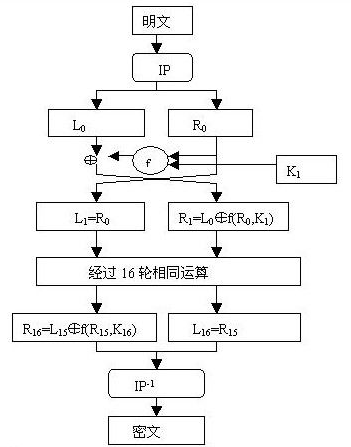

### IP置换

IP置换目的是**将输入的64位数据块按位重新组合**，并把输出分为`L0`、`R0`两部分，每部分各长`32`位。

置换规则如下表所示：

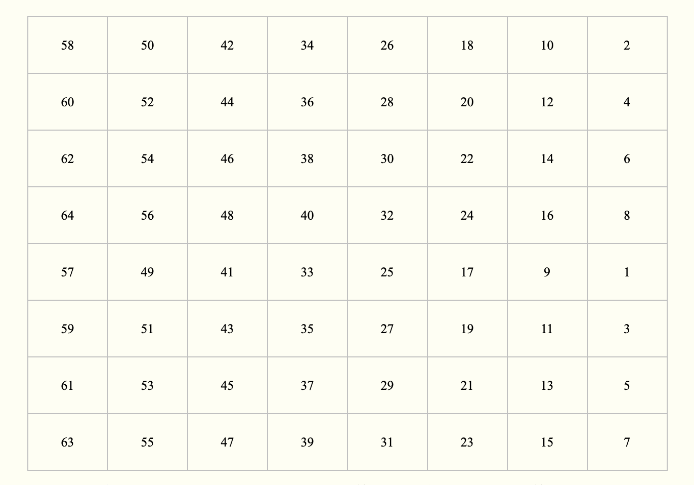

表中的数字代表新数据中此位置的数据在原数据中的位置，即原数据块的第58位放到新数据的第1位，第50位放到第2位，……依此类推，第7位放到第64位。置换后的数据分为L0和R0两部分，L0为新数据的左32位，R0为新数据的右32位。

要注意一点，位数是从左边开始数的，即最0x0000 0080 0000 0002最左边的位为1，最右边的位为64。

### 密钥置换

不考虑每个字节的第8位，DES的密钥由64位减至56位，每个字节的第8位作为奇偶校验位。产生的56位密钥由下表生成（注意**表中没有8,16,24，32,40,48,56和64这8位**）：

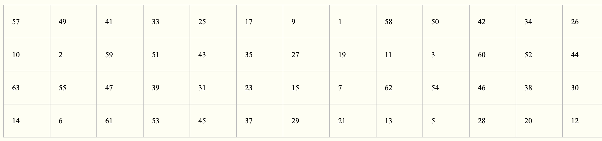

在DES的每一轮中，从56位密钥产生出不同的48位子密钥，确定这些子密钥的方式如下：

　　1).将56位的密钥分成两部分，每部分28位。

　　2).根据轮数，这两部分分别循环左移1位或2位。每轮移动的位数如下表：

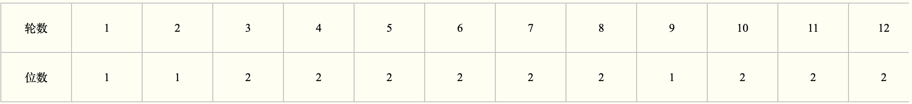

移动后，从56位中选出48位。这个过程中，既置换了每位的顺序，又选择了子密钥，因此称为压缩置换。压缩置换规则如下表（注意**表中没有9，18，22，25，35，38，43和54这8位**）：

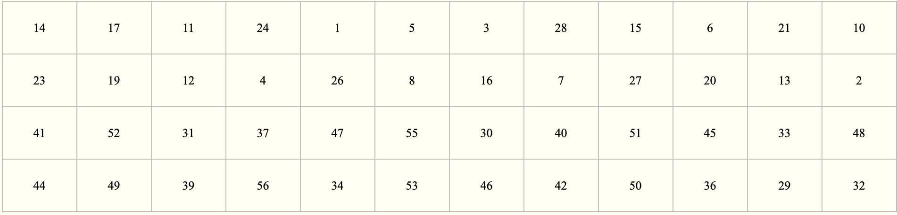

置换方法同上，此处省略。

### 扩展置换

扩展置置换目标是**IP置换后获得的右半部分R0，将32位输入扩展为48位(分为4位×8组)输出**。

扩展置换目的有两个：**生成与密钥相同长度的数据以进行异或运算；提供更长的结果，在后续的替代运算中可以进行压缩**。

扩展置换原理如下表：

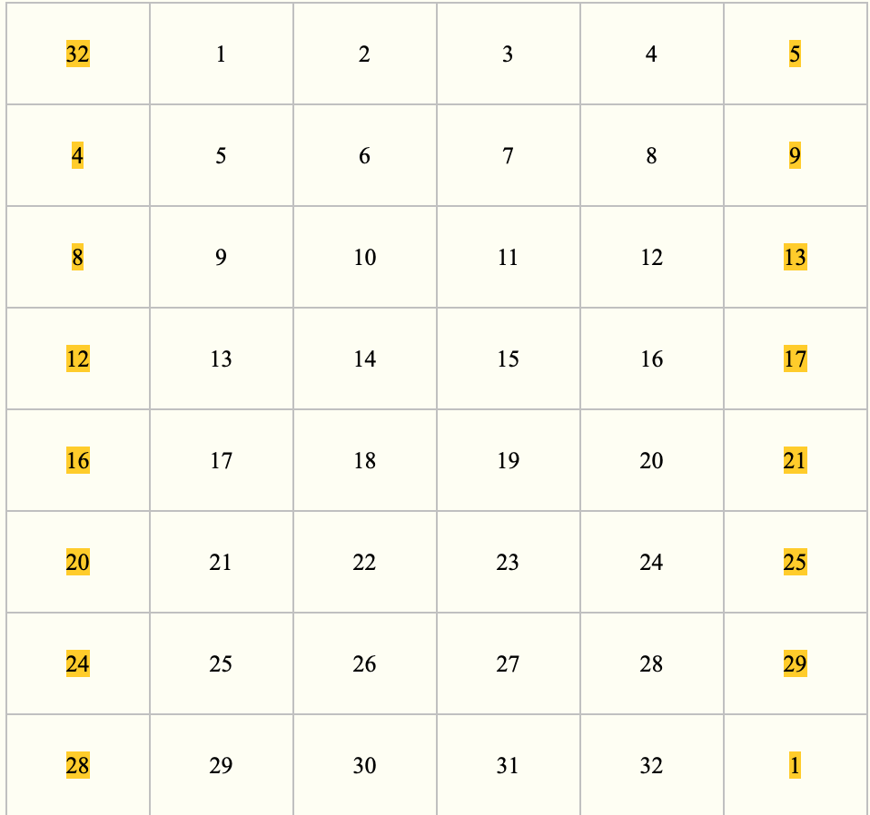

表中的数字代表位，两列黄色数据是扩展的数据，可以看出，扩展的数据是从相邻两组分别取靠近的一位，4位变为6位。靠近32位的位为1，靠近1位的位为32。表中第二行的4取自上组中的末位，9取自下组中的首位。

我们举个例子看一下(虽然扩展置换针对的是上步IP置换中的R0，但为便于观察扩展，这里不取R0举例)：

输入数据0x1081 1001，转换为二进制就是0001 0000 1000 0001B，按照上表扩展得下表

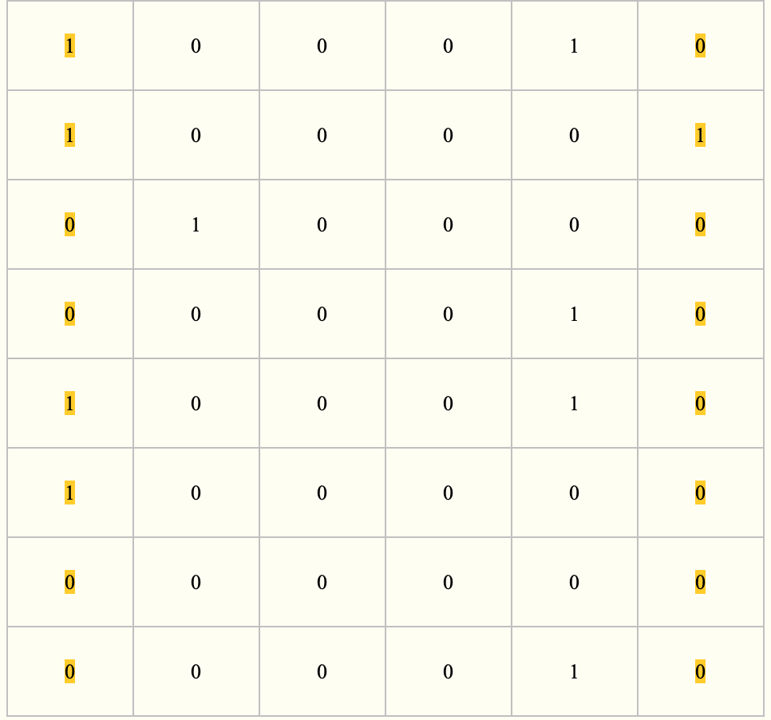

表中的黄色数据是从临近的上下组取得的，二进制为1000 1010 0001 0100 0000 0010 1000 1010 0000 0000 0000 0010B，转换为十六进制0x8A14 028A 0002。

扩展置换之后，右半部分数据R0变为48位，与密钥置换得到的轮密钥进行异或。

### S盒代替

压缩后的密钥与扩展分组异或以后得到48位的数据，将这个数据送入S盒，进行替代运算。替代由8个不同的S盒完成，每个S盒有6位输入4位输出。48位输入分为8个6位的分组，一个分组对应一个S盒，对应的S盒对各组进行代替操作。

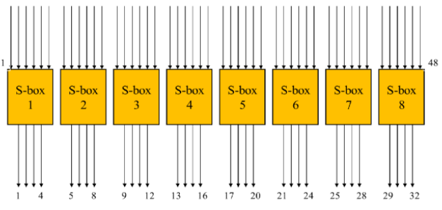

　　一个S盒就是一个4行16列的表，盒中的每一项都是一个4位的数。S盒的6个输入确定了其对应的输出在哪一行哪一列，输入的高低两位做为行数H，中间四位做为列数L，在S-BOX中查找第H行L列对应的数据(<32)。

　　8个S盒如下：

　　S盒1

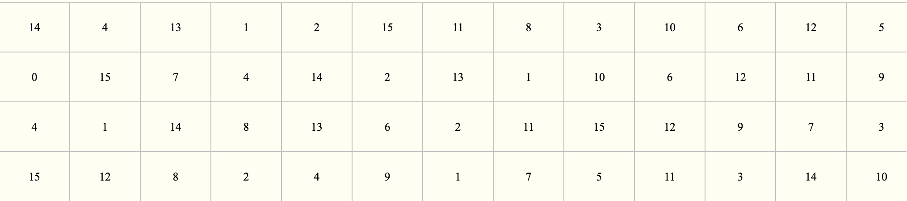

　　S盒2

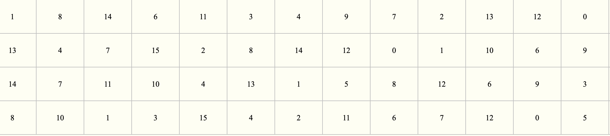

　　S盒3

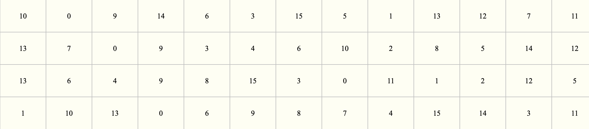

　　S盒4

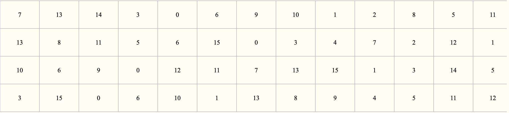

　　S盒5

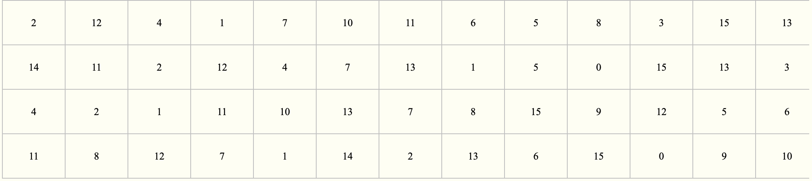

　　S盒6

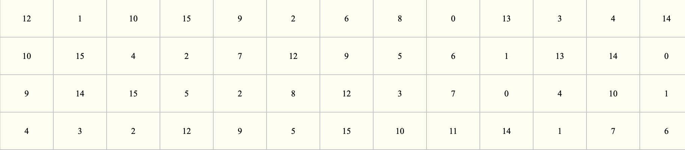

　　S盒7

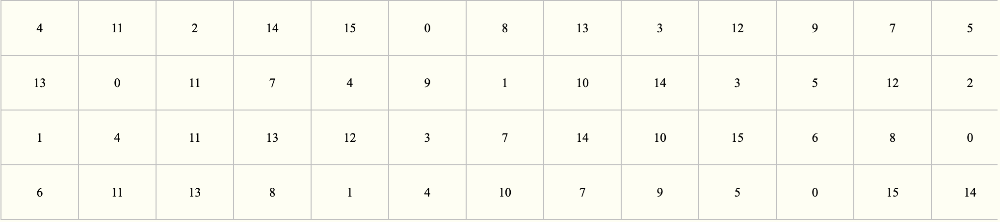

　　S盒8

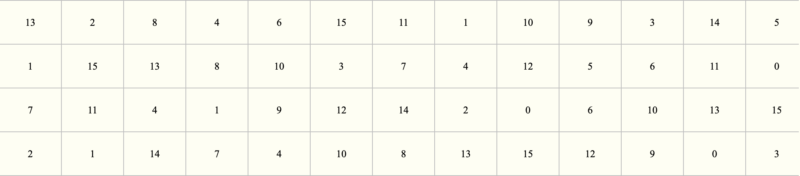

例如，假设S盒8的输入为110011，第1位和第6位组合为11，对应于S盒8的第3行；第2位到第5位为1001，对应于S盒8的第9列。S盒8的第3行第9列的数字为12，因此用1100来代替110011。注意，S盒的行列计数都是从0开始。

代替过程产生8个4位的分组，组合在一起形成32位数据。

S盒代替是DES算法的关键步骤，所有的其他的运算都是线性的，易于分析，而S盒是非线性的，相比于其他步骤，提供了更好安全性。

### P盒置换

S盒代替运算的32位输出按照P盒进行置换。该置换把输入的每位映射到输出位，任何一位不能被映射两次，也不能被略去，映射规则如下表：

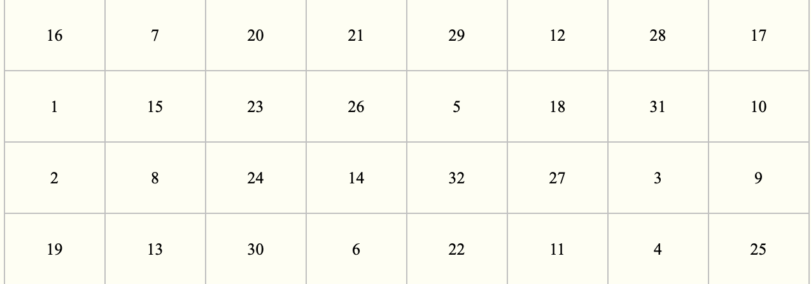

表中的数字代表原数据中此位置的数据在新数据中的位置，即原数据块的第16位放到新数据的第1位，第7位放到第2位，……依此类推，第25位放到第32位。

例如0x10A1 0001进行P盒置换后变为0x8000 0886。

0x10A1 0001表现为表的形式（第一位位于左上角）原来为

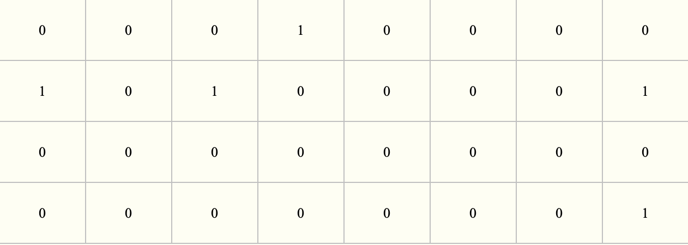

　　经P盒变换后为

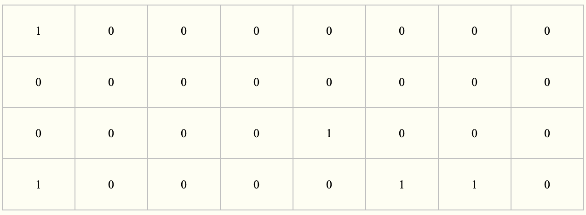

即1000 0000 0000 0000 0000 1000 1000 0110B，十六进制为0x8000 0886。

最后，P盒置换的结果与最初的64位分组左半部分L0异或，然后左、右半部分交换，接着开始另一轮。

### IP(-1)末置换

末置换是初始置换的逆过程，DES最后一轮后，左、右两半部分并未进行交换，而是两部分合并形成一个分组做为末置换的输入。末置换规则如下表：

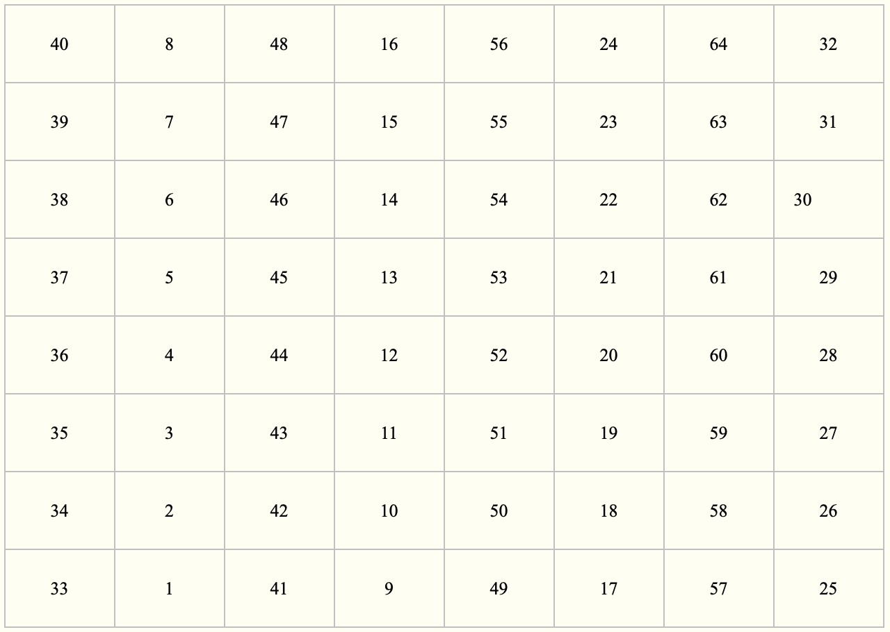

置换方法同上，此处省略。

经过以上步骤，就可以得到密文了。

## 代码实现

```c++
// DES.cpp : 此文件包含 "main" 函数。程序执行将在此处开始并结束。
//
 
#include "pch.h"
#include <iostream>
#include <fstream>
#include <string>
using namespace std;
 
//记录所有的子秘钥
int eachKey[16][48];
 
int boxS[8][4][16] = { //S1
    {   {14,4,13,1,2,15,11,8,3,10,6,12,5,9,0,7},
        {0,15,7,4,14,2,13,1,10,6,12,11,9,5,3,8},
        {4,1,14,8,13,6,2,11,15,12,9,7,3,10,5,0},
        {15,12,8,2,4,9,1,7,5,11,3,14,10,0,6,13}
    },
    //S2
    {   {15,1,8,14,6,11,3,4,9,7,2,13,12,0,5,10},
        {3,13,4,7,15,2,8,14,12,0,1,10,6,9,11,5},
        {0,14,7,11,10,4,13,1,5,8,12,6,9,3,2,15},
        {13,8,10,1,3,15,4,2,11,6,7,12,0,5,14,9}
    },
    //S3
    {   {10,0,9,14,6,3,15,5,1,13,12,7,11,4,2,8},
        {13,7,0,9,3,4,6,10,2,8,5,14,12,11,15,1},
        {13,6,4,9,8,15,3,0,11,1,2,12,5,10,14,7},
        {1,10,13,0,6,9,8,7,4,15,14,3,11,5,2,12}
    },
    //S4
    {   {7,13,14,3,0,6,9,10,1,2,8,5,11,12,4,15},
        {13,8,11,5,6,15,0,3,4,7,2,12,1,10,14,9},
        {10,6,9,0,12,11,7,13,15,1,3,14,5,2,8,4},
        {3,15,0,6,10,1,13,8,9,4,5,11,12,7,2,14}
    },
    //S5
    {   {2,12,4,1,7,10,11,6,8,5,3,15,13,0,14,9},
        {14,11,2,12,4,7,13,1,5,0,15,10,3,9,8,6},
        {4,2,1,11,10,13,7,8,15,9,12,5,6,3,0,14},
        {11,8,12,7,1,14,2,13,6,15,0,9,10,4,5,3}
    },
    //S6
    {   {12,1,10,15,9,2,6,8,0,13,3,4,14,7,5,11},
        {10,15,4,2,7,12,9,5,6,1,13,14,0,11,3,8},
        {9,14,15,5,2,8,12,3,7,0,4,10,1,13,11,6},
        {4,3,2,12,9,5,15,10,11,14,1,7,6,0,8,13}
    },
    //S7
    {   {4,11,2,14,15,0,8,13,3,12,9,7,5,10,6,1},
        {13,0,11,7,4,9,1,10,14,3,5,12,2,15,8,6},
        {1,4,11,13,12,3,7,14,10,15,6,8,0,5,9,2},
        {6,11,13,8,1,4,10,7,9,5,0,15,14,2,3,12}
    },
    //S8
    {   {13,2,8,4,6,15,11,1,10,9,3,14,5,0,12,7},
        {1,15,13,8,10,3,7,4,12,5,6,11,0,14,9,2},
        {7,11,4,1,9,12,14,2,0,6,10,13,15,3,5,8},
        {2,1,14,7,4,10,8,13,15,12,9,0,3,5,6,11}
    }
};
 
//记录左移次数
int leftMove[16] = { 1,1,2,2,2,2,2,2,1,2,2,2,2,2,2,1 };
 
int C[28] = { 0 }, D[28] = { 0 };
int L[32] = { 1 }, R[32] = { 1 };
 
//p置换
int P[32] = {16,7,20,21,29,12,28,17,1,15,23,26,5,18,31,10,2,8,24,14,32,27,3,9,19,13,30,6,22,11,4,25};
 
//E扩展
int biteChoiceLabel[48] = { 32,1,2,3,4,5,
                4,5,6,7,8,9,
                    8,9,10,11,12,13,
                          12,13,14,15,16,17,
                    16,17,18,19,20,21,
                20,21,22,23,24,25,
                 24,25,26,27,28,29,
                         28,29,30,31,32,1};
 
//秘钥置换
int keySwap[8][6] = { {14,17,11,24,1,5},
                 {3,28,15,6,21,10},
                 {23,19,12,4,26,8 },
                 {16,7,27,20,13,2},
                 {41,52,31,37,47,55},
                 {30,40,51,45,33,48},
                 {44,49,39,56,34,53},
                 {46,42,50,36,29,32} };
 
//密文初始置换
int IP[8][8] = { {58, 50, 42, 34, 26, 18, 10, 2,},
{60,52,44,36,28,20,12,4, },
{62,54,46,38,30,22,14,6,},
{64,56,48,40,32,24,16,8, },
{57,49,41,33,25,17,9,1,},
{59,51,43,35,27,19,11,3,},
{61,53,45,37,29,21,13,5,},
{63,55,47,39,31,23,15,7 }};
 
//密文逆置换
int IP_1[8][8] = { {40,8,48,16,56,24,64,32},
                   {39,7,47,15,55,23,63,31},
                   {38,6,46,14,54,22,62,30},
                   {37,5,45,13,53,21,61,29},
                   {36,4,44,12,52,20,60,28},
                   {35,3,43,11,51,19,59,27},
                   {34,2,42,10,50,18,58,26},
                   {33,1,41,9,49,17,57,25} };
 
//64->56选择
int PC_1[8][7] = { {57,49,41,33,25,17,9},
                   {1,58,50,42,34,26,18},
                   {10,2,59,51,43,35,27},
                   {19,11,3,60,52,44,36},
                   {63,55,47,39,31,23,15},
                   {7,62,54,46,38,30,22},
                   {14,6,61,53,45,37,29},
                   {21,13,5,28,20,12,4} };
 
 
//初始置换IP
void InitIP(int **input) {
    int s[64];
    int c = 0;
    for(int i = 0;i<8;i++)
        for (int j = 0; j < 8; j++) {
            s[c++] = input[i][j];
        }
    int **newIP = new int *[8];
    for (int i = 0; i < 8; i++)
        newIP[i] = new int[8];
 
    for (int i = 0; i < 8; i++) {
        for (int j = 0; j < 8; j++) {
            int loc = IP[i][j] - 1; //因为从1开始，这里下标减一
            newIP[i][j] = s[loc];
        }
    }
    int l = 0, m = 0;
    for(int i = 0;i < 8;i++)
        for (int j = 0; j < 8; j++) {
            if (i * 8 + j < 32)
                L[l++] = newIP[i][j];
            else
                R[m++] = newIP[i][j];
        }
}
 
//逆初始置换
void reverse() {
    int temp[64];
    int a[64];
    for (int i = 0; i < 32; i++) {
        temp[i] = L[i];
        temp[i + 32] = R[i];
    }
    
    int l = 0, m = 0;
    for (int i = 0; i < 8; i++) {
        for (int j = 0; j < 8; j++) {
            a[l++] = temp[IP_1[i][j] - 1];
        }
    }
    l = 0;
    for (int i = 0; i < 64; i++)
        if (i < 32)
            L[l++] = a[i];
        else
            R[m++] = a[i];
}
 
//操作函数f
int *f(int n, int flag) {
    int *result = new int[32];
    int a[48];
    int temp[56];
    int newKey[48];
    for (int i = 0; i < 28; i++) {
        temp[i] = C[i];
        temp[i + 28] = D[i];
    }
    int l = 0;
    if (flag == 0) {
        for (int i = 0; i < 8; i++) {
            for (int j = 0; j < 6; j++) {
                int loc = keySwap[i][j];
                newKey[l++] = temp[loc - 1];
                eachKey[15-n][l - 1] = newKey[l - 1];   //记录加密时的全部子秘钥
            }
        }
    }
    else {
        for (int i = 0; i < 48; i++)
            newKey[i] = eachKey[n][i];
    }
    int newR[48];
    for (int i = 0; i < 48; i++)
        newR[i] = R[biteChoiceLabel[i]-1];
    for (int i = 0; i < 48; i++)
        a[i] = (newKey[i]+newR[i])%2;
    int b[8][6];
    int r[8];
    l = 0;
    int m = 0;
    int k = 0;
    for (int i = 0; i < 48; i++) {
        b[l][m] = a[i];
        if ((i + 1) % 6 == 0) {
            int first = b[l][0] * 2 + b[l][5];
            int second = b[l][1] * 8 + b[l][2] * 4 + b[l][3] * 2 + b[l][4];
            r[l] = boxS[l][first][second];
            l++;
            m = 0;
        }
        else
            m++;
    }
    int c[8][4];
    l = 0;
    for (int i = 0; i < 8; i++) {
        int ti = 0;
        int aa = r[i] / 8;
        int bb = (r[i] - aa * 8) / 4;
        int cc = (r[i] - aa * 8 - bb * 4) / 2;
        int dd = r[i] - aa * 8 - bb * 4 - cc * 2;
        c[i][0] = aa;
        c[i][1] = bb;
        c[i][2] = cc;
        c[i][3] = dd;
    }
    int tempP[32];
    for (int i = 0; i < 8; i++)
        for (int j = 0; j < 4; j++) {
            tempP[l++] = c[i][j];
        }
    for (int i = 0; i < 32; i++)
        result[i] = tempP[P[i] - 1];
    return result;
}
 
//交换处理
void swap(int n, int flag) {
    int tempL[32], tempR[32];
    int *Result = new int[32];
    //数据备份
    for (int i = 0; i < 32; i++) {
        tempR[i] = R[i];
        tempL[i] = L[i];
    }
    Result = f(n, flag);
    //数据更新计
    for (int i = 0; i < 32; i++) {
        L[i] = tempR[i];
        R[i] = (tempL[i] + Result[i]) % 2;
    }
    if (n == 15) {
        for (int i = 0; i < 32; i++) {
            int temp = L[i];
            L[i] = R[i];
            R[i] = temp;
        }
    }
}
 
 
 
//产生第一轮秘钥（64位->56位)
int **firstKey(int **key) {
    int **fk = new int *[8];
    for (int i = 0; i < 8; i++)
        fk[i] = new int[7];
    int nk[64];
    int s = 0;
    int l = 0, m = 0;
    for (int i = 0; i < 8; i++)
        for (int j = 0; j < 8; j++)
            nk[s++] = key[i][j];
    for (int i = 0; i < 8; i++) {
        for (int j = 0; j < 7; j++) {
            int loc = PC_1[i][j] - 1;
            fk[i][j] = nk[loc];
            if (l < 28)
                C[l++] = nk[loc];
            else
                D[m++] = nk[loc];
        }
    }
    return fk;
}
 
//循环产生子秘钥
void nextKeyLeft(int n) {
    int times = leftMove[n];
    for (int i = 0; i < times; i++) {
        int C0 = C[0];
        int D0 = D[0];
        for (int j = 1; j < 28; j++) {
            C[j - 1] = C[j];
            D[j - 1] = D[j];
        }
        C[27] = C0;
        D[27] = D0;
    }
}
 
 
//十六进制输入转二进制
int **hxTobin(string input) {
    int a[64];
    int x[16];
    int **init_letters = new int *[8];
    for (int i = 0; i < 8; i++)
        init_letters[i] = new int[8];
    int j = 0;
    for (int i = 0; i < 16; i++) {
        if (input[i] >= '0' && input[i] <= '9')
            x[i] = input[i] - 48;
        else if (input[i] >= 'A' && input[i] <= 'Z')
            x[i] = input[i] - 55;
        else
            x[i] = input[i] - 87;
    }
    for (int i = 0; i < 16; i++) {
        int aa = x[i] / 8;
        int bb = (x[i] - aa * 8) / 4;
        int cc = (x[i] - aa * 8 - bb * 4) / 2;
        int dd = x[i] - aa * 8 - bb * 4 - cc * 2;
        a[j] = aa;
        a[j + 1] = bb;
        a[j + 2] = cc;
        a[j + 3] = dd;
        j = j + 4;
    }
    
    int l = 0;
    for (int i = 0; i < 8; i++) {
        for (j = 0; j < 8; j++) {
            init_letters[i][j] = a[l++];
        }
    }
    return init_letters;
}
 
//二进制密文转十六进制密文
string binTohx(int a[]) {
    string res;
    res.resize(16);
    int j = 0;
    for (int i = 0; i < 64; i+=4) {
        int b = a[i] * 8 + a[i + 1] * 4 + a[i + 2] * 2 + a[i + 3];
        if (b < 10)
            res[j] = b+'0';
        else{
            switch (b) {
            case 10:
                res[j] = 'a';
                break;
            case 11:
                res[j] = 'b';
                break;
            case 12:
                res[j] = 'c';
                break;
            case 13:
                res[j] = 'd';
                break;
            case 14:
                res[j] = 'e';
                break;
            case 15:
                res[j] = 'f';
                break;
            }
        }
        j++;
    }
    return res;
}
 
//解密过程
void decode(string res) {
    int **re = new int *[8];
    for (int i = 0; i < 8; i++)
        re[i] = new int[8];
    re = hxTobin(res);
    InitIP(re);
    for (int i = 0; i < 16; i++) {
        swap(i, 1);
    }
    reverse();
    int a[64];
    for (int i = 0; i < 32; i++) {
        a[i] = L[i];
        a[i + 32] = R[i];
    }
    string input;
    input = binTohx(a);
    std::cout << input << endl << endl;;
}
 
 
int main()
{
    string letters;
    string keys;
    string words;
    char flag='n';
    int miwen[64];
    ifstream file;
    file.open("test.txt");
    int **fir = new int *[8];
    for (int i = 0; i < 8; i++)
        fir[i] = new int[8];
    cout << "--------- Begin(y/n)? ----------" << endl;
    cin >> flag;
    while (flag == 'y' &&!file.eof()) {
        std::cout << "---------- 读入密文: ----------" << endl;
        if (!file) {
            std::cout << "---------- 读取失败 ----------" << endl;
            exit(0);
        }
        getline(file, letters);
        std::cout << "明文: " << letters << endl << endl;
        std::cout << "---------- 读入秘钥: ----------" << endl;
        getline(file, keys);
        std::cout << "秘钥: " << keys << endl << endl;
        fir = hxTobin(keys);
        int **getLetters = new int *[8];
        for (int i = 0; i < 8; i++)
            getLetters[i] = new int[8];
        getLetters = hxTobin(letters);
        InitIP(getLetters);
        int **fk = new int *[8];
        for (int i = 0; i < 8; i++)
            fk[i] = new int[7];
        for (int i = 0; i <= 16; i++) {
            if (i == 0) {
                fk = firstKey(fir);
            }
            else {
                nextKeyLeft(i - 1);
                swap(i - 1, 0);
            }
        }
        reverse();
        int k = 0;
        for (int i = 0; i < 32; i++) {
            miwen[k++] = L[i];
        }
        for (int i = 0; i < 32; i++) {
            miwen[k++] = R[i];
        }
        words = binTohx(miwen);
        std::cout << "密文: " << words << endl;
        std::cout << "----------  解密中  ----------" << endl;
        decode(words);
        std::cout << "-----------  继续(y/n) ---------" << endl;
        std::cin >> flag;
    }
    std::cout << "---------- End! ----------" << endl;
    return 0;
}
```
