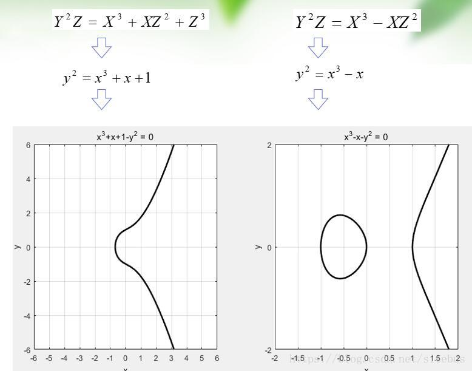
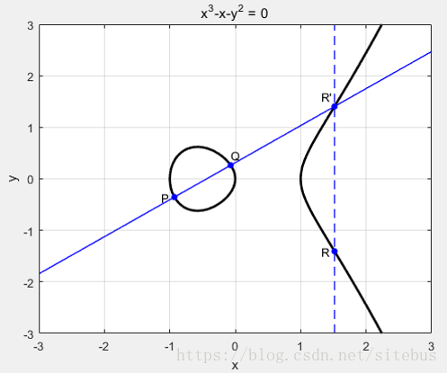
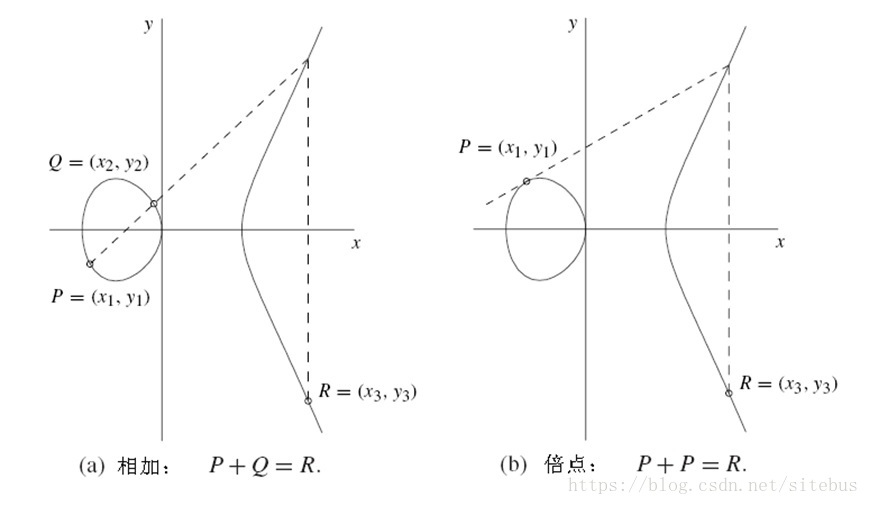
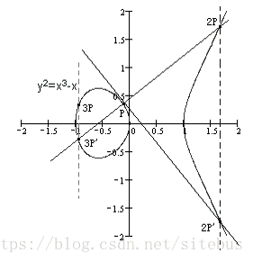
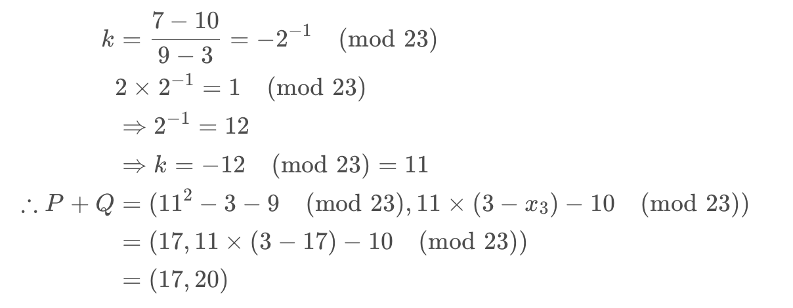
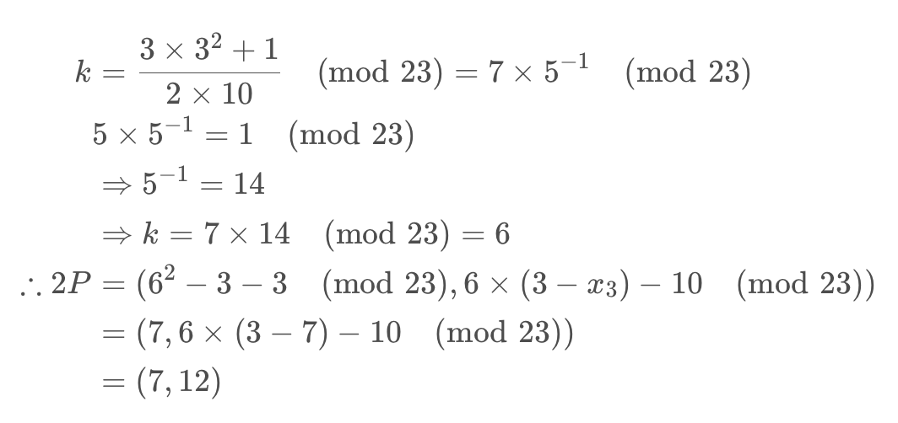
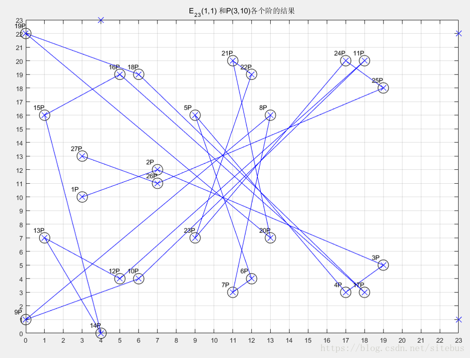

# ECC

RSA的解决分解整数问题需要亚指数时间复杂度的算法，而目前已知计算椭圆曲线离散对数问题(ECDLP)的最好方法都需要全指数时间复杂度。这意味着在椭圆曲线系统中我们只需要使用相对于RSA 短得多的密钥就可以达到与其相同的安全强度。例如，一般认为160比特的椭圆曲线密钥提供的安全强度与1024比特RSA密钥相当。使用短的密钥的好处在于加解密速度快、节省能源、节省带宽、存储空间。
比特币以及中国的二代身份证都使用了256 比特的椭圆曲线密码算法。

## 实数椭圆曲线

什么是椭圆曲线，想必大家都会首先想到的是高中时学到的标准椭圆曲线方程。
$$\frac{x^2}{a^2} + \frac{y^2}{b^2} = 1 ( a > b ，焦点在 x 轴 ， a < b ， 焦点在 y 轴 )$$

其实本文提到的椭圆曲线，跟这个高中时代的椭圆曲线方程基本无关。椭圆曲线的椭圆一词来源于椭圆周长积分公式。(这个命名深究起来比较复杂，了解一下就可以了)

一条椭圆曲线是在射影平面上满足威尔斯特拉斯方程（Weierstrass）所有点的集合，
$$Y^2 Z + a_1 X Y Z + a_3 Y Z^2 = X^3 + a_2 X^2 Z + a_4 X Z^2 + a_6 Z^3$$

对普通平面上点(x,y)，令x=X/Z，y=Y/Z，Z≠0，得到如下方程
$$y^2Z^3+a_1xyZ^3+a_3yZ^3=x^3Z^3+a_2x^2Z^3+a_4xZ^3+a_6Z^3$$  
约掉$Z^3$
可以得到：
$$y^2+a_1xy+a_3y=x^3+a_2x^2+a_4x+a_6$$ 
简化版的Weierstrass方程：
$$E: y^2= x^3+ax+b$$
其中，
(1) $\Delta= -16(4a^3+27b) \neq 0$,用来保证曲线是光滑的，即曲线的所有点都没有两个或者两个以上的不同的切线。
(2)$a,b\in K, K为E的基础域。$
(3) 点$O_\infty$是曲线的唯一的无穷远点。

## 椭圆曲线实例



## 椭圆曲线阿贝尔群

我们已经看到了椭圆曲线的图象，但点与点之间好象没有什么联系。我们能不能建立一个类似于在实数轴上加法的运算法则呢？这就要定义椭圆曲线的加法群，这里需要用到近世代数中的阿贝尔群。

在数学中，**群是一种代数结构，由一个集合以及一个二元运算所组成**。已知集合和运算(G,*),如果是群则必须满足如下要求。

封闭性：∀a,b∈G，ab∈G

结合性：∀a,b,c∈G，有 (ab)c = a(b*c)

单位元：ョe∈G，∀a∈G，有ea = ae = a

逆元：∀a∈G，ョb∈G 使得 ab = ba = e

交换性: ∀a,b∈G，ab = ba

同样在椭圆曲线也可以定义阿贝尔群。
任意取椭圆曲线上两点P、Q（若P、Q两点重合，则作P点的切线），作直线交于椭圆曲线的另一点R’，过R’做y轴的平行线交于R，定义P+Q=R。这样，加法的和也在椭圆曲线上，并同样具备加法的交换律、结合律。



### 同点加法

若有k个相同的点P相加，记作kP 。 P+P=2P



P+P+P=2P+P=3P



## 有限域椭圆曲线

椭圆曲线是连续的，并不适合用于加密；所以，我们必须把椭圆曲线变成离散的点，我们要把椭圆曲线定义在有限域上。

我们给出一个有限域Fp

Fp中有p（p为质数）个元素0,1,2,…, p-2,p-1

+ Fp的加法是 $a+b\equiv c \pmod p$

+ Fp的乘法是 $a×b \equiv c \pmod p$

+ Fp的除法是 $a÷b \equiv c \pmod p，即 a×b^{-1} \equiv c \pmod p，b^{-1}也是一个0到p-1之间的整数，但满足b×b^{-1}\equiv 1 \pmod p$

+ Fp的单位元是1，零元是 0

+ Fp域内运算满足交换律、结合律、分配律

+ 椭圆曲线Ep(a,b)，p为质数，x,y∈[0,p-1]
    $$y^2=x^3+ax+b \pmod p$$
    选择两个满足下列约束条件的小于p的非负整数a、b :
    $$4a^3 + 27b^2 \neq 0 \pmod p$$

Fp上的椭圆曲线同样有加法

1. 无穷远点$O_∞是零元，有O_∞+ O_∞= O_∞，O_∞+P=P$

2. P(x,y)的负元是 (x,-y mod p)= (x,p-y) ，有$P+(-P)= O_∞$
​
3. $P(x_1,y_1),Q(x_2,y_2)的和R(x_3,y_3)$有如下关系：
    $$x3≡k2−x1−x2(modp)$$
    $$y3≡k(x1−x3)−y1(modp)$$
    $$若P=Q,则k=3x21+a2y1(modp)$$
    $$若P≠Q,则k=y2−y1x2−x1(modp)$$

例题椭圆曲线已知E23(1,1)上两点P(3,10)，Q(9,7)，求

(1) -P
(2) P+Q
(3) 2P

$$−P=(3,−10(mod23))=(3,13)$$





## 有限域椭圆曲线点的阶

如果椭圆曲线上一点P，存在最小的正整数n使得数乘$nP=O_∞$,则将n称为P的阶.
若n不存在，则P是无限阶的.



计算可得$27P=-P=(3,13)$, 所以$28P=O_∞$ ,P的阶为28

这些点做成了一个循环阿贝尔群，其中生成元为P，阶数为28。显然点的分布与顺序都是杂乱无章。

## 椭圆曲线加密

考虑 K=kG ，其中K、G为椭圆曲线Ep(a,b)上的点，n为G的阶 $(nG=O_∞ )$，k为小于n的整数。则给定k和G，根据加法法则，计算K很容易但反过来，给定K和G，求k就非常困难。因为实际使用中的ECC原则上把p取得相当大，n也相当大，要把n个解点逐一算出来列成上表是不可能的。这就是椭圆曲线加密算法的数学依据 。

+ 点G称为基点（base point)
+ k(k<n) 为私有密钥（private key)
+ K为公开密钥（public key)

下面是利用椭圆曲线进行加密通信的过程：

1. 用户A选定一条椭圆曲线Ep(a,b)，并取椭圆曲线上一点，作为基点G。
2. 用户A选择一个私有密钥k，并生成公开密钥K=kG。
3. 用户A将Ep(a,b)和点K，G传给用户B。
4. 用户B接到信息后 ，将待传输的明文编码到Ep(a,b)上一点M（编码方法很多，这里不作讨论），并产生一个随机整数r（r<n）。
5. 用户B计算点$C_1=M+rK$和$C_2=rG$
6. 用户B将$C_1、C_2$传给用户A。
7、用户A接到信息后，计算$C_1-kC_2$，结果就是点M。再对点M进行解码就可以得到明文。

因为$C_1-kC_2=M+rK-k(rG)=M+rkG-krG=M$

## ECC技术要求

通常将Fp上的一条椭圆曲线描述为T=(p,a,b,G,n,h)p、a、b确定一条椭圆曲线（p为质数，(mod p)运算）G为基点，n为点G的阶，h是椭圆曲线上所有点的个数m与n相除的商的整数部分

参量选择要求：

+ p越大安全性越好，但会导致计算速度变慢
+ 200bit左右可满足一般安全要求
+ n应为质数 h≤4；p≠n×h ；pt≠1(mod n) (1≤t＜20)
+ $4a^3 + 27b^2 \neq 0 \pmod p$

## ECC保密通信算法例子

1. Alice选定一条椭圆曲线E，并取椭圆曲线上一点作为基点G 假设选定$E_{29}(4,20)$，基点G(13,23) , 基点G的阶数n=37
2. Alice选择一个私有密钥k（k<n）比如25，并生成公开密钥K=kG = 25G = (14,6）
3. Alice将E和点K、G传给Bob
4. Bob收到信息后，将待传输的明文编码到E上的一点M，并产生一个随机整数r（r<n,n为G的阶数） 假设r=6 要加密的信息为3,因为M也要在$E_{29}(4,20)$上，所以M=(3,28)
5. Bob计算点$C_1$和$C_2$
    $$C1=M+rK=M+6K=M+6G=(3,28)+6×(14,6)=(3,28)+(27,27)=(6,12)$$
    $$C2=rG=6G=(5,7)$$
6. Bob将$C_1、C_2$传给Alice
7. Alice收到信息后，计算$C_1-kC_2$，结果就是$M = C_1-kC_2 =(6,12)-25C_2 =(6,12)-25\times(5,7) =(6,12)-(27,27) =(6,12)+(27,2) =(3,28)$

## ECC vs. RSA – ECC的优缺点

|优点|缺点|
|-|-|
|安全性能更高：160位ECC与1024位RSA、DSA有相同的安全强度|设计困难，实现复杂|
|处理速度更快：在私钥的处理速度上，ECC远 比RSA、DSA快得多|如果序列号设计过短，那么安全性并没有想象中的完善|
|带宽要求更低||
|存储空间更小：ECC的密钥尺寸和系统参数与RSA、DSA相比要小得多|

## ECC 代码实现

```python
# -*- coding:utf-8 -*-
import random

# 辗转相除求最大公因数
def div_fac( a, b ):
    if b !=  0:
        result = div_fac( b, a % b )
    else:
        result = a
    return result

# 将负数结果转化为正数
def check_neg( a , b ):
    while a <= 0:
        a += b
    return a

# 利用勒让德符号和二次互反律判断平方剩余是否存在
def Leg_Prime( a , p ):
    a = a % p  
    flag = 1 ; a_x = [] ; i = 2 ; tmp = a
    while i < tmp ** 0.5:
        if tmp % i == 0:
            tmp //= i
            a_x.append(i)
            i = 2
        else:
            i += 1
    else:
        a_x.append(tmp)

    for i in a_x:
        if i == 2:
            if p % 8 == 1 or p % 8 == 7:
                flag *= 1
            else:
                flag *= ( -1 )
        elif i == -1 or a == p-1:
            if p % 4 == 1:
                flag *= 1
            else:
                flag *= ( -1 )
        #flag_tmp = ( -1 ) ** (( a - 1 ) * ( p - 1 ) / 4) * Leg_Prime( p % i , i )
        elif i == 0:
            return 0
        else:
            flag *= ( ( -1 ) ** (( a - 1 ) * ( p - 1 ) / 4 ) ) * Leg_Prime( p , i )

    return flag

# ECC加密中的加法运算实现
def ECC_Add( A , B , p , a):
    if A != B:
        dx = A[0] - B[0]
        dy = A[1] - B[1]
    else:
        dy = 3 * ( A[0] ** 2 ) + a
        dx = 2 * A[1]
    if dx == 0 :
        return 0
    fac = div_fac( dx , dy )
    dy //= fac
    dx //= fac
    tmp = dy % p
    check_neg( tmp , p )
    while tmp % dx != 0:
        tmp += p
    k = tmp // dx
    C_x = ( k ** 2 - A[0] - B[0] ) % p
    check_neg( C_x , p )
    C_y = ( k * ( A[0] - C_x ) - A[1] ) % p
    check_neg( C_y , p )
    return (C_x,C_y)

# 求基点的阶
def Find_Order( G , p , a ):
    flag = 1 ; A = G ; B = G
    while flag :
        flag += 1
        A = ECC_Add(A,B,p,a)
        if (( A[0] ** 3 + A[0] + 1 ) % p ) == (( A[1] ** 2 ) % p ):
            if A[0] == G[0]:
                return flag + 1
        else:
            print("Error!!!")
            print("在第 " + str(flag) + " 次运算后结果错误！")
            return -1

# 求取公钥
def ECC_PublickeyFind(p,a,G,d):
    A = G ; B = G
    i = 1
    while i < d:
        i += 1
        A = ECC_Add(A,B,p,a)
        if A == 0:
            i += 1
            A = G
    return A

# 将明文嵌入曲线
def ECC_M(m,p,a,b):
    M = []
    for j in m.encode('utf-8'):
        j = j * 30
        tmp = 0 ; flag = 0
        while tmp < 100:
            x = j + tmp
            y_2 = ( x ** 3 + a * x + b ) % p
            tmp += 1
            if Leg_Prime( y_2 , p ) == 1:
                for i in range(1,p):
                    if ( i ** 2 - y_2 ) % p == 0:
                        M.append(( x , i ))
                        flag = 1
                        break
                if flag == 1:
                    break
        else:
            print("明文某字节在嵌入曲线时 100 次没有得到平方剩余")
            exit()
    return M

def ECC_encode(M,G,K,r,p,a):
    r_G = ECC_PublickeyFind(p,a,G,r)
    r_K = ECC_PublickeyFind(p,a,K,r)
    C_1 = []
    for i in M:
        C_1.append(ECC_Add(i,r_K,p,a))
    print("C1为:",end='')
    for i in C_1:
        print(str(i) + ',' ,end='')
    else:
        print()
    print("C2为:" + str(r_G))

def ECC_Encrypt(p,a,b,G,n,d,m):
    K = ECC_PublickeyFind(p,a,G,d)
    print("公钥为：" + str(K))
    M = ECC_M(m,p,a,b)
    r = random.randint(1,n-1)
    ECC_encode(M,G,K,r,p,a)

def ECC_Decrypt(C1,C2,d,p,a):
    C2_tmp = ECC_PublickeyFind(p,a,C2,d)
    C2 = (C2_tmp[0],-C2_tmp[1])
    for i in C1:
        M = ECC_Add(i,C2,p,a)[0] // 30
        print(chr(M),end='')
    print()

if __name__ == "__main__":
    p,a,b,G,n = 4177,1,1,(0,1),28
    print("本程序使用曲线方程为：y^2 = x^3 + x + 1")
    print("参数 p 选择为 23，基点为 (0,1), n 为 28")
    print("为减小计算压力，本程序为ASCII字符集逐字节加密")
    d = eval(input("请输入私钥："))
    m = input("请输入要加密的数据：")

    ECC_Encrypt(p,a,b,G,n,d,m)

    C1 = eval(input("请输入C1:"))
    C2 = eval(input("请输入C2:"))

    ECC_Decrypt(C1,C2,d,p,a)
```
