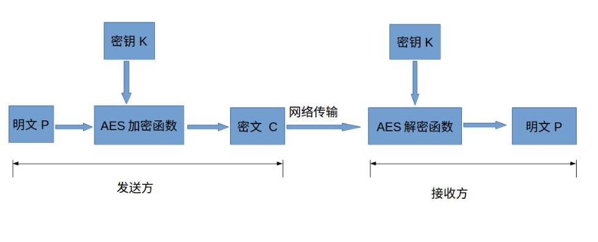
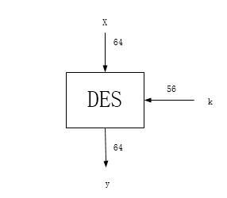

# Crypto

在这里简单介绍下对称加密算法与非对称加密算法。

+ 对称加密算法
加密和解密用到的密钥是相同的，这种加密方式加密速度非常快，适合经常发送数据的场合。缺点是密钥的传输比较麻烦。

+ 非对称加密算法
加密和解密用的密钥是不同的，这种加密方式是用数学上的难解问题构造的，通常加密解密的速度比较慢，适合偶尔发送数据的场合。优点是密钥传输方便。常见的非对称加密算法为RSA、ECC和EIGamal。

实际中，一般是通过非对称加密算法加密对称加密算法的密钥，传输到接收方，接收方解密得到对称加密算法的密钥，然后发送方和接收方用对称加密算法来通信。

这里我们主要选择其中常见的进行介绍分析

## 对称加密算法

### AES算法

高级加密标准(AES,Advanced Encryption Standard)为最常见的对称加密算法(微信小程序加密传输就是用这个加密算法的)。对称加密算法也就是加密和解密用相同的密钥，简易的加密流程如下图：

下面简单介绍下各个部分的作用与意义：

+ 明文P
没有经过加密的数据。

+ 密钥K
用来加密明文的密码，在对称加密算法中，加密与解密的密钥是相同的。密钥为接收方与发送方协商产生，但不可以直接在网络上传输，否则会导致密钥泄漏，通常是通过非对称加密算法加密密钥，然后再通过网络传输给对方，或者直接面对面商量密钥。密钥是绝对不可以泄漏的，否则会被攻击者还原密文，窃取机密数据。

+ AES加密函数
设AES加密函数为E，则 `C = E(K, P)`,其中P为明文，K为密钥，C为密文。也就是说，把明文P和密钥K作为加密函数的参数输入，则加密函数E会输出密文C。

+ 密文C
经加密函数处理后的数据

+ AES解密函数
设AES解密函数为D，则 `P = D(K, C)`,其中C为密文，K为密钥，P为明文。也就是说，把密文C和密钥K作为解密函数的参数输入，则解密函数会输出明文P。

### DES算法

在过去30年中的大多数时间里，数据加密标准(Data Encryption Standard,DES)显然是最主流的分组密码。尽管当前DES已经不再安全——因为它的密钥空间实在太小；但DES任然用于那些历史遗留下来难以更新的应用中。此外，使用DES连续三次对数据进行加密——这个过程也成为3DES——也可以得到非常安全的密码，并且此方法至今仍广泛使用。更重要的是，由于DES是目前研究最透彻的对称算法，其设计理念给当前许多密码设计提供了一定的启发作用。因此，学习DES也可以帮助我们更好的理解其他许多对称算法。

1. 强加密的基本思想与理念
根据著名信息理论学家Clauder Shannon的理论，强加密算法都是基于以下两种本质操作：
(1) **混淆：是一种使秘钥和密文之间的关系尽可能模糊的加密操作**。如今实现混淆常用的一个元素就是替换，这个元素在DES和AES中都有使用；
(2) **扩散：是一种为了隐藏明文的统计属性而将一个明文符号的影响扩散到多个密文符号的加密操作**。最简单的扩散元素就是位置换，它常用于DES中；而AES中则使用更高级的Mixcolumn操作。
仅执行扩散的密码是不安全的，比如移位密码。然而将扩散操作串联起来就可以建立一个更强壮的密码。这样的密码也叫乘积密码。**目前，所有的分组密码都是乘积密码，因为他们都是由对数据重复操作的轮组成的。**

2. DES算法概述
DES是一种使用56位秘钥对64位分组进行加密的对称密码。

与几乎现在所有的分组加密一样，DES也是一种迭代算法。DES对明文中每个分组的加密过程都包含16轮，且每轮的操作完全相同。每轮使用不同的密钥秘钥，并且所有子密钥都是从主密钥k中推导出来的。

### 3DES算法

DES是一个经典的对称加密算法，但也缺陷明显，即56位的密钥安全性不足，已被证实可以在短时间内破解。为解决此问题，出现了3DES，也称Triple DES，3DES为DES向AES过渡的加密算法，它使用3条56位的密钥对数据进行三次加密。为了兼容普通的DES，3DES并没有直接使用 `加密->加密->加密` 的方式，而是采用了`加密->解密->加密` 的方式。

当三重密钥均相同时，前两步相互抵消，相当于仅实现了一次加密，因此可实现对普通DES加密算法的兼容。

## 非对称加密算法

非对称加密算法也叫公钥密码算法，通过生成的公私钥来对明文密文进行加密解密

### RSA算法

1977年，三位数学家Rivest、Shamir 和 Adleman 设计了一种算法，可以实现非对称加密。这种算法用他们三个人的名字命名，叫做RSA算法。从那时直到现在，RSA算法一直是最广为使用的"非对称加密算法"。毫不夸张地说，只要有计算机网络的地方，就有RSA算法。

它是基于一种数学难题而发明出来的算法，破解它既是最简单的又是最难的——只需要一直算就可以破解，算力越强破解越快。但是以人类今天的顶级算力来进行破解也只能破解2048位以内的公私钥。

### ECC算法

ECC全称为“Ellipse Curve Ctyptography”，是一种基于椭圆曲线数学的公开密钥加密算法。椭圆曲线在密码学中的使用是在1985年由Neal Koblitz和Victor Miller分别独立提出的。与传统的基于大质数分解难题的加密算法不同，该加密方式基于 “离散对数” 这种数学难题。该算法的主要优势是可以使用更小的密钥病提供相当高等级的安全。ECC164位的密钥产生一个安全级，相当于RSA 1024位密钥提供的保密强度，而且计算量较小，处理速度更快，存储空间和传输带宽占用较少。目前我国居民二代身份证正在使用 256 位的椭圆曲线密码，虚拟货币比特币也选择ECC作为加密算法。
