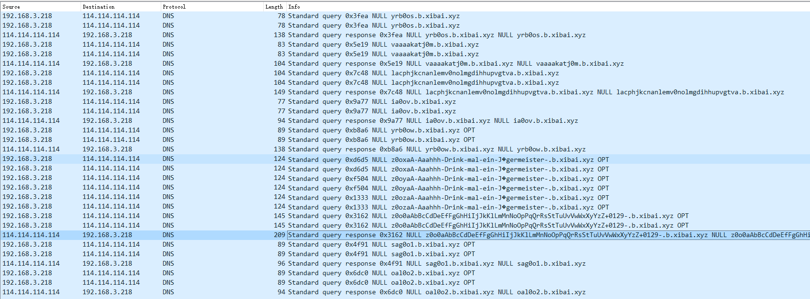

# DNS_Tunnel 分析

## 前置知识：DNS 协议

### 协议简介

域名系统（Domain Name System，缩写：DNS）是互联网的一项服务。它作为将域名和IP地址相互映射的一个分布式数据库，能够使人更方便地访问互联网。DNS使用`TCP`和`UDP`端口`53`。当前，对于`每一级域名长度的限制是63个字符`，`域名总长度则不能超过253个字符`。DNS协议是用来将`域名转换为IP`地址（也可以将IP地址转换为相应的域名地址）。

DNS系统采用`递归查询`请求的方式来响应用户的查询，为互联网的运行提供关键性的基础服务。目前绝**大多数的防火墙和网络都会开放DNS服务**，**DNS数据包不会被拦截，因此可以基于DNS协议建立隐蔽信道，从而顺利穿过防火墙，在客户端和服务器之间传输数据**。

DNS允许终端用户设备将给定的人类可读URL转换为网络可以理解的机器可用IP地址。Internet Engineering Task Force(IETF)标准组对HTTP和DNS进行了标准化定义。原始的DNS标准是在1987年发布的，因为用户在使用网络浏览器的同时需要使用其他应用程序，例如将电子邮件地址转换为IP地址。

### 协议报文格式

DNS 定义了两种报文 ，一种为`查询报文`；另一种是对查询报文的响应，称为`响应报文`。无论是查询报文还是响应报文，**其报文的格式都是相同的**：

一个 `header` 和 四个数据块：`question`, `answer`, `authority`, `additional space`.

这里只需要关注`header`、`question`和`answer`即可

#### 特殊说明

DNS作为一个协议，它**本身只包含只对数据报文的组成结构和服务原理的要求**。
其它诸如：
    用户请求了一个域名，DNS协议完全不管该域名的内容是怎样的，**用户想要请求什么内容就能请求什么内容，只是正常响应结果有或没有的区别**（正常响应结果无的话会响应无，有的话响应请求内容对应的ip）；
    或者服务器接收到了一个域名解析请求，**服务器的响应内容除了协议要求的必须内容外，在规定长度内可以任意返回其他数据**。

**即用户可以在DNS协议数据包的基础内容之外，根据自己的目的完全自定义的添加冗余内容**.

#### header

`header`中的各个标志位控制着后面四个数据块的内容。

|  Field   |                                                        Description                                                        | Length (bits) |
|----------|---------------------------------------------------------------------------------------------------------------------------|---------------|
|    QR    |    Indicates if the message is a query (0) or a reply (1)                                                                 |       1       |
|  OPCODE  |    The type can be QUERY (standard query, 0), IQUERY (inverse query, 1), or STATUS (server status request, 2)             |       4       |
|    AA    |    Authoritative Answer, in a response, indicates if the DNS server is authoritative for the queried hostname             |       1       |
|    TC    |    TrunCation, indicates that this message was truncated due to excessive length                                          |       1       |
|    RD    |    Recursion Desired, indicates if the client means a recursive query                                                     |       1       |
|    RA    |    Recursion Available, in a response, indicates if the replying DNS server supports recursion                            |       1       |
|    Z     |    Zero, reserved for future use                                                                                          |       3       |
|  RCODE   |    Response code, can be NOERROR (0), FORMERR (1, Format error), SERVFAIL (2), NXDOMAIN (3, Nonexistent domain), etc.[33] |       4       |

#### question

| Field |              Description              | Length (octets) |
|-------|---------------------------------------|-----------------|
|  NAME |   Name of the requested resource      |     Variable    |
|  TYPE |   Type of RR (A, AAAA, MX, TXT, etc.) |         2       |
| CLASS |   Class code                          |         2       |

NAME部分是被拆开的域名，每一级都以该部分的长度为前缀。例如：


可以看到 `06` 长度为六，内容是后面六字节的内容：`yrb0os`。

#### answer

| Field |              Description              | Length (octets) |
|-------|---------------------------------------|-----------------|
|  NAME |   Name of the requested resource      |     Variable    |
|  TYPE |   Type of RR (A, AAAA, MX, TXT, etc.) |         2       |
| CLASS |   Class code                          |         2       |
|  TTL  |   Time to live                        |         4       |
|  LEN  |   DATA's length                       |         2       |
|  DATA |                                       |     Variable    |

正常的DNS服务其实响应包只有两种情况，为止域名，answer数量为0，或者解析域名成功返回相应的ip地址。

## DNS_Tunnel 原理

根据DNS的原理机制，我们可以知道，当防火墙或者说waf没有去专门设置针对DNS流量的拦截检测时，默认是对DNS流量不管不顾的。即：**DNS本身就可以穿透大多数情况下的防火墙和waf**。

这种情况下，我们通过自己手中控制的域名和具有公网IP的服务器，就可以构建一台恶意DNS服务器，为我们提供基于DNS流量的交互行为支持。即：DNS隧道。

具体过程简单描述为：

**客户端程序构造恶意DNS域名查询请求，其数据包根据域名最终被路由到我们架设的恶意DNS服务器，服务端接收到后根据预先设置好的规则解析出其中携带的数据进而执行用户想要执行的操作，最终绕过防御机制实现访问穿透。**

## DNS_Tunnel常见特征

大批量的DNS流量包。且其请求的域名的根域名不是正确的常见域名，例如：gooogle.com、badu.com、Coogle.com等等。考虑到混淆手段的存在，在筛选DNS流量时攻击者也可能加入大量对正常域名的请求，但一定会存在不常见根域名，且其子域名前缀也不寻常。

简单举个例子：我设置了一个DNS隧道服务器，我的恶意请求为：pingxxxxxxxxxxxx.b.xibai.xyz，直接把想执行的明文命令(`pingxxxxxxxxxxxx`)传给服务器，或者预先自定义一套编码规则，将明文命令经编码后传输，以base64再次举例：cgluzwxxxxxxxxxxxxxxxxxx.b.xibai.xyz。只需要这一条请求我就可以把想法告知服务端，然后我对其他一些正常域名进行大量请求掩饰它，普通人往往就会将其忽略。

随着架设的DNS隧道客户端与服务端支持的功能越强大，其域名一定有越多可能，DNS请求量也会随之加大。但是一切都只能以DNS协议的基本规则为基础才能展开。

## 常用DNS_Tunnel工具分析

### iodine

#### 特殊说明

+ 此工具为开源工具，故分析时涉及源码的部分均采用作者源码，方便分析
+ raw-mode模式仅限服务端为Linux时可用（可在启动参数中加 `-r` 跳过 `raw-mode`）
+ 客户端为Win10时，环境搭建后，可连接成功，但无法ping通（即不可用！）
+ 国内的域名解析服务设置`NS记录`后，经测试，该程序不能正确处理现今公网DNS返回的数据包，所以`中继模式`无法成功建立连接，只能使用`直接转发模式`。（未测试局域网状态下的DNS中继模式）

#### 工作机制

1. 通过TAP虚拟网卡（即需要单独安装tap-driver），在服务端机器（相应程序iodined）建立一个局域网（如ip为10.0.0.1）,**局域网网段为自定义**；
2. 客户端机器（相应程序iodine）也需要TAP建立虚拟网卡；
3. DNS隧道流程：iodine客户端->DNS服务商->iodined服务端
4. 服务端程序 iodined 提供特定域名的DNS解析服务。当客户端请求该域名的解析，就可以建立通道连接。
5. 两者通过DNS隧道，同处于一个局域网（即两张虚拟网卡IP会在同一个局域网）。

#### 流量特征总结

通过结合源码分析该工具的流量，可以发现此工具的传输流量其实存在诸多特征。

1. 客户端发起的第一阶段握手包，正常的情况一定是`yrbxxx`的形式
2. 服务端对于第一阶段 `yrbxxx` 握手包的响应数据一定是：`00000000ffffffff55555555aaaaaaaa8163c8d2c77cb2175f4fcec9492d522161a9712025b30673e6d84430795057bf`
3. 客户端第二阶段握手包的子域名开头根据使用的版本会有不同的固定开头。第一字节固定为`v`，而后默认是`base32`编码的版本号，若是非魔改的最新官方版，则必为`vaaaaka`开头
4. 服务端对于第二阶段握手包的响应依旧是预设关键字开头。正常的关键字为：`VACK`，而后的数据则是服务器返回的四字节的`seed`和一字节的`userid`
5. 第三阶段是身份验证，此阶段没有固定特征值，但服务端会返回两个明文ip地址，一个是隧道的虚拟网关ip，一个是分配给客户端的虚拟局域网ip
6. 接下来可能会出现`ix0xxx`开头的六字节子域名。同时此处是一个分岔路，若为 `i` 开头，握手阶段可能会在这里直接结束。按照源码分析其实此处应该一定会有`ix0xxx`开头的子域名DNS数据包，但实测的时候发现有时没有该包，这里暂不深究其原因。其中 `ix0` 中间的`x`取值范围为：`a-z`+`0-5`。
7. 针对 6 中客户端发送的数据，服务端有两种响应情况，一种是 开头为 `I` 的五字节数据，另一种是开头为 `I` 的17字节数据。
8. 接下来在源码中存在二次登陆验证，过程同上，不过这次将`seed`值加一（注，该过程多数情况下会返回 failed ，观察流量包发现测试用二进制文件并无此步骤，暂未深究）
9. 若握手阶段没有在上一步结束，则接下来客户端一定会给服务器发一个子域名前五字节与第一个握手包相同的流量包（即：`yrbxx`），且服务端的返回值同上 2 。
10. 此时，客户端会发送子域名 `zxxx` 开头的数据包，其中 `xxx` 的值可以忽略，后面的明文数据则是程序内置的固定字符串，目的为测试程序内置编码是否可用。这里罗列出来：

    >"aAbBcCdDeEfFgGhHiIjJkKlLmMnNoOpPqQrRsStTuUvVwWxXyYzZ+0129-"
    >
    >"aAbBcCdDeEfFgGhHiIjJkKlLmMnNoOpPqQrRsStTuUvVwWxXyYzZ_0129-"
    >
    >"aA-Aaahhh-Drink-mal-ein-J\344germeister-"
    >
    >"aA-La-fl\373te-na\357ve-fran\347aise-est-retir\351-\340-Cr\350te"
    >
    >"aAbBcCdDeEfFgGhHiIjJkKlLmMnNoOpPqQrRsStTuUvVwWxXyYzZ"
    >
    >"aA0123456789\274\275\276\277\300\301\302\303\304\305\306\307\310\311\312\313\314\315\316\317"
    >
    >"aA\320\321\322\323\324\325\326\327\330\331\332\333\334\335\336\337\340\341\342\343\344\345\346\347\350\351\352\353\354\355\356\357\360\361\362\363\364\365\366\367\370\371\372\373\374\375"

11. 根据 10 中编码测试的结果，接下来会有三种 `sxxxxx` 的子域名DNS包，第二位 `x` 代表userid，第三位 `x` 代表使用的编码算法。
12. 服务端接收到 11 中的流量包后会返回编码算法的明文名称。
13. 接上，客户端会发送子域名 `oxxxxx` 开头的请求，第一个 `x` 同11，第二个 `x` 取值为：`tsuvrli`,根据第二个 `x` 的取值，服务端会返回对应的明文：`Base32`、`Base64`、`Base64u`、`Base128`、`Raw`、`Lazy`、`Immediate`。
14. 然后客户端会发送 `rxxxd` 开头的子域名的请求。第一个 `x` 依旧代表`userid`，后两个则与子域名数据的长度相关
15. 握手阶段最后，客户端会发送 `nxxxxx` 开头的子域名请求。第一个 `x` 代表 `userid` ，第二第三个 `x` 与 接下来传输数据时每个数据包能携带的数据量相关
16. 隧道服务阶段： 两种数据包。
    1. userid + `xxx` + `x`(a-z 0-9) 的前缀
    2. `p` + `xxxxxxx` 的前缀

#### 过程流量分析

wireshark抓取本地客户端与服务器建立通信的流量，如下：


`b.xibai.xyz`是服务端绑定的域名。

这里多次抓包可以发现，iodine客户端向服务端发送数据报文时，**第一次一定会发送带有六字节前缀的域名**，其中前三字节固定为`yrb`。而服务端在接收到之后进行回应时，其响应包的内容也为固定的48字节

>00000000ffffffff55555555aaaaaaaa8163c8d2c77cb2175f4fcec9492d522161a9712025b30673e6d84430795057bf

这里用 dig 简单测试一下发现 ：

```shell
$ dig yrb123.b.xibai.xyz NULL   

; <<>> DiG 9.10.3-P4-Ubuntu <<>> yrb123.b.xibai.xyz NULL
;; global options: +cmd
;; Got answer:
;; ->>HEADER<<- opcode: QUERY, status: NOERROR, id: 13418
;; flags: qr rd ra; QUERY: 1, ANSWER: 1, AUTHORITY: 0, ADDITIONAL: 0

;; QUESTION SECTION:
;yrb123.b.xibai.xyz.        IN    NULL

;; ANSWER SECTION:
yrb123.b.xibai.xyz.    0    IN    NULL    \# 48 00000000FFFFFFFF55555555AAAAAAAA8163C8D2C77CB2175F4FCEC9 492D522161A9712025B30673E6D84430795057BF

;; Query time: 78 msec
;; SERVER: 127.0.1.1#53(127.0.1.1)
;; WHEN: Fri Aug 13 10:37:05 CST 2021
;; MSG SIZE  rcvd: 96


# root0 @ x1-bai in ~ [10:37:05] 
$ dig yrb.b.xibai.xyz NULL 

; <<>> DiG 9.10.3-P4-Ubuntu <<>> yrb.b.xibai.xyz NULL
;; global options: +cmd
;; Got answer:
;; ->>HEADER<<- opcode: QUERY, status: NOERROR, id: 18215
;; flags: qr rd ra; QUERY: 1, ANSWER: 1, AUTHORITY: 0, ADDITIONAL: 0

;; QUESTION SECTION:
;yrb.b.xibai.xyz.        IN    NULL

;; ANSWER SECTION:
yrb.b.xibai.xyz.    0    IN    NULL    \# 6 4241444C454E

;; Query time: 57 msec
;; SERVER: 127.0.1.1#53(127.0.1.1)
;; WHEN: Fri Aug 13 10:38:25 CST 2021
;; MSG SIZE  rcvd: 51


# root0 @ x1-bai in ~ [10:38:25] 
$ dig 123123.b.xibai.xyz NULL

; <<>> DiG 9.10.3-P4-Ubuntu <<>> 123123.b.xibai.xyz NULL
;; global options: +cmd
;; Got answer:
;; ->>HEADER<<- opcode: QUERY, status: NOERROR, id: 60473
;; flags: qr rd ra; QUERY: 1, ANSWER: 1, AUTHORITY: 0, ADDITIONAL: 0

;; QUESTION SECTION:
;123123.b.xibai.xyz.        IN    NULL

;; ANSWER SECTION:
123123.b.xibai.xyz.    0    IN    NULL    \# 5 4241444950

;; Query time: 39 msec
;; SERVER: 127.0.1.1#53(127.0.1.1)
;; WHEN: Fri Aug 13 10:39:33 CST 2021
;; MSG SIZE  rcvd: 53
```

六字节前缀的后三字节完全不影响结果，只有当前三字节不为`yrb`时才会影响结果。

由此去分析源码，可以发现：

```c++
static void
send_downenctest(int fd, char downenc, int variant)
{
    char prefix[4] = "y__";
    prefix[1] = tolower(downenc);
    prefix[2] = b32_5to8(variant);

    /* Use send_query directly if we ever send more data here. */
    send_handshake_query(fd, prefix);
}
```

其中在`handshake_qtypetest`中调用了`send_downenctest`

```c++
static int
handshake_qtypetest(int dns_fd, int timeout)
/* Returns:
   0: doesn't work with this timeout
   1: works properly
*/
{

    if (do_qtype == T_NULL || do_qtype == T_PRIVATE)
        trycodec = 'R';
    else
        trycodec = 'T';

    /* We could use 'Z' bouncing here, but 'Y' also tests that 0-255
       byte values can be returned, which is needed for NULL/PRIVATE
       to work. */

    send_downenctest(dns_fd, trycodec, 1);

    read = handshake_waitdns(dns_fd, in, sizeof(in), 'y', 'Y', timeout);
}
```

第一字节固定为`y`、第三字节固定为`b`、第二字节用来校验确认dns请求的`qtype`。
后三字节是一个随机值，但并没有用到，可以不考虑。

在源码中可以较为清晰的看到`握手阶段`的各个细节。

```c++
int
client_handshake(int dns_fd, int raw_mode, int autodetect_frag_size, int fragsize)
{
    int seed;
    int upcodec;
    int r;

    dnsc_use_edns0 = 0;

    /* qtype message printed in handshake function */
    if (do_qtype == T_UNSET) {
        r = handshake_qtype_autodetect(dns_fd);
        if (r) {
            return r;
        }
    }

    fprintf(stderr, "Using DNS type %s queries\n", client_get_qtype());

    r = handshake_version(dns_fd, &seed);
    if (r) {
        return r;
    }

    r = handshake_login(dns_fd, seed);
    if (r) {
        return r;
    }

    if (raw_mode && handshake_raw_udp(dns_fd, seed)) {
        conn = CONN_RAW_UDP;
        selecttimeout = 20;
    } else {
        if (raw_mode == 0) {
            fprintf(stderr, "Skipping raw mode\n");
        }

        dnsc_use_edns0 = 1;
        if (handshake_edns0_check(dns_fd) && running) {
            fprintf(stderr, "Using EDNS0 extension\n");
        } else if (!running) {
            return -1;
        } else {
            fprintf(stderr, "DNS relay does not support EDNS0 extension\n");
            dnsc_use_edns0 = 0;
        }

        upcodec = handshake_upenc_autodetect(dns_fd);
        if (!running)
            return -1;

        if (upcodec == 1) {
            handshake_switch_codec(dns_fd, 6);
        } else if (upcodec == 2) {
            handshake_switch_codec(dns_fd, 26);
        } else if (upcodec == 3) {
            handshake_switch_codec(dns_fd, 7);
        }
        if (!running)
            return -1;

        if (downenc == ' ') {
            downenc = handshake_downenc_autodetect(dns_fd);
        }
        if (!running)
            return -1;

        if (downenc != ' ') {
            handshake_switch_downenc(dns_fd);
        }
        if (!running)
            return -1;

        if (lazymode) {
            handshake_try_lazy(dns_fd);
        }
        if (!running)
            return -1;

        if (autodetect_frag_size) {
            fragsize = handshake_autoprobe_fragsize(dns_fd);
            if (!fragsize) {
                return 1;
            }
        }

        handshake_set_fragsize(dns_fd, fragsize);
        if (!running)
            return -1;
    }

    return 0;
}
```

跟进各个握手函数，可以了解握手阶段的数据编码情况。

当握手成功之后，则通过`client_tunnel`函数建立隧道。客户端main函数中流程如下：

```c++
if (client_handshake(dns_fd, raw_mode, autodetect_frag_size, max_downstream_frag_size)) {
        retval = 1;
        goto cleanup2;
    }

    if (client_get_conn() == CONN_RAW_UDP) {
        fprintf(stderr, "Sending raw traffic directly to %s\n", client_get_raw_addr());
    }

    fprintf(stderr, "Connection setup complete, transmitting data.\n");

    if (foreground == 0)
        do_detach();

    if (pidfile != NULL)
        do_pidfile(pidfile);

    if (newroot != NULL)
        do_chroot(newroot);

    if (username != NULL) {
#ifndef WINDOWS32
        gid_t gids[1];
        gids[0] = pw->pw_gid;
        if (setgroups(1, gids) < 0 || setgid(pw->pw_gid) < 0 || setuid(pw->pw_uid) < 0) {
            warnx("Could not switch to user %s!\n", username);
            usage();
            /* NOTREACHED */
        }
#endif
    }

    if (context != NULL)
        do_setcon(context);

    client_tunnel(tun_fd, dns_fd);
```

跟进该函数，即可对该工具实现的DNS隧道中通过的流量进行解析。
首先发现设置了一个简单的超时关闭机制：

```c++
        i = select(MAX(tun_fd, dns_fd) + 1, &fds, NULL, NULL, &tv);

         if (lastdownstreamtime + 60 < time(NULL)) {
             warnx("No downstream data received in 60 seconds, shutting down.");
             running = 0;
         }

        if (running == 0)
            break;

        if (i < 0)
            err(1, "select");

        if (i == 0) {
            /* timeout */
            if (is_sending()) {
                /* Re-send current fragment; either frag
                   or ack probably dropped somewhere.
                   But problem: no cache-miss-counter,
                   so hostname will be identical.
                   Just drop whole packet after 3 retries,
                   and TCP retransmit will solve it.
                   NOTE: tun dropping above should be
                   >=(value_here - 1) */
                if (outchunkresent < 3) {
                    outchunkresent++;
                    send_chunk(dns_fd);
                } else {
                    outpkt.offset = 0;
                    outpkt.len = 0;
                    outpkt.sentlen = 0;
                    outchunkresent = 0;

                    send_ping(dns_fd);
                }
            } else {
                send_ping(dns_fd);
            }
            send_ping_soon = 0;

        }
```

通过`send_ping`函数维持隧道活性，但若一分钟内没有接收到服务端的回应则判断网络超时进而关闭隧道连接。而后则是核心功能函数`tunnel_tun`和`tunnel_dns`

```c++
        else {

            if (FD_ISSET(tun_fd, &fds)) {
                if (tunnel_tun(tun_fd, dns_fd) <= 0)
                    continue;
                /* Returns -1 on error OR when quickly
                   dropping data in case of DNS congestion;
                   we need to _not_ do tunnel_dns() then.
                   If chunk sent, sets send_ping_soon=0. */
            }
            if (FD_ISSET(dns_fd, &fds)) {
                if (tunnel_dns(tun_fd, dns_fd) <= 0)
                    continue;
            }
        }
```

跟进分析可知，`tunnel_tun`为**本地指令流量->本地恶意DNS流量**；`tunnel_dns`为**本地恶意DNS流量->本地指令流量**。
**本地指令流量->本地恶意DNS流量** 时会先进行一次`zlib.compress2()`的压缩，然后使用指定编码进行一次编码并加上固定格式的五字节前缀，最后才会发送出去。

```c++
static void
send_chunk(int fd)
{
    char buf[4096];
    int avail;
    int code;
    char *p;
    static int datacmc = 0;
    char *datacmcchars = "abcdefghijklmnopqrstuvwxyz0123456789";

    p = outpkt.data;
    p += outpkt.offset;
    avail = outpkt.len - outpkt.offset;

    /* Note: must be same, or smaller than send_fragsize_probe() */
    outpkt.sentlen = build_hostname(buf + 5, sizeof(buf) - 5, p, avail,
                    topdomain, dataenc, hostname_maxlen);

    /* Build upstream data header (see doc/proto_xxxxxxxx.txt) */

    buf[0] = userid_char;		/* First byte is hex userid */

    code = ((outpkt.seqno & 7) << 2) | ((outpkt.fragment & 15) >> 2);
    buf[1] = b32_5to8(code); /* Second byte is 3 bits seqno, 2 upper bits fragment count */

    code = ((outpkt.fragment & 3) << 3) | (inpkt.seqno & 7);
    buf[2] = b32_5to8(code); /* Third byte is 2 bits lower fragment count, 3 bits downstream packet seqno */

    code = ((inpkt.fragment & 15) << 1) | (outpkt.sentlen == avail);
    buf[3] = b32_5to8(code); /* Fourth byte is 4 bits downstream fragment count, 1 bit last frag flag */

    buf[4] = datacmcchars[datacmc];	/* Fifth byte is data-CMC */
    datacmc++;
    if (datacmc >= 36)
        datacmc = 0;

#if 0
    fprintf(stderr, "  Send: down %d/%d up %d/%d, %d bytes\n",
        inpkt.seqno, inpkt.fragment, outpkt.seqno, outpkt.fragment,
        outpkt.sentlen);
#endif

    send_query(fd, buf);
}

static int
tunnel_tun(int tun_fd, int dns_fd)
{
    unsigned long outlen;
    unsigned long inlen;
    char out[64*1024];
    char in[64*1024];
    ssize_t read;

    if ((read = read_tun(tun_fd, in, sizeof(in))) <= 0)
        return -1;

    /* We may be here only to empty the tun device; then return -1
       to force continue in select loop. */
    if (is_sending())
        return -1;

    outlen = sizeof(out);
    inlen = read;
    compress2((uint8_t*)out, &outlen, (uint8_t*)in, inlen, 9);

    memcpy(outpkt.data, out, MIN(outlen, sizeof(outpkt.data)));
    outpkt.sentlen = 0;
    outpkt.offset = 0;
    outpkt.seqno = (outpkt.seqno + 1) & 7;
    outpkt.len = outlen;
    outpkt.fragment = 0;
    outchunkresent = 0;

    if (conn == CONN_DNS_NULL) {
        send_chunk(dns_fd);

        send_ping_soon = 0;
    } else {
        send_raw_data(dns_fd);
    }

    return read;
}
```

五字节前缀：第一字节为`userid`的字符形式，即：userid：1，则该字节为：0x31('1')；第二三四字节是DNS报文的三个属性值，可以暂时忽略；第五字节是一个自定义CRC校验。

这里简单说一下该程序自定义的CRC校验：

因为`DNS服务`都是通过`UDP`流量通信的，`UDP`是不可靠协议，假如服务器没有接收到你的数据包，服务器就不会知道你对它发送了这个数据包，同时，如果你发送了多个`UDP`数据包，但是它们因为网络延迟问题被服务器接收时的顺序乱序了，服务器也不能知道谁先谁后。

所以，该程序预先设置了一组字符：`abcdefghijklmnopqrstuvwxyz0123456789`，发送数据包时会按顺序选取该字符串的字符设置为CRC校验字节，**主要目的为让服务器能用来判断数据包顺序，而非常规的CRC数据校验。**

由此，该工具对流量的处理流程分析完毕，再去查看流量包数据内容。


此时选中的即是建立隧道之后客户端发送的第一个**本地指令流量->本地DNS流量**，它的前五个字节：`1eaba`，第一位代表`userid`: 1，中间三位忽略，最后一位 `a` ：第一个发送的流量包数据。

后面的子域名即为要传输给服务器的数据。利用python脚本进行解码（该例中通信采用了程序内置的Base128编码,**实战场景中可以通过查看握手阶段数据包中的明文得知编码格式**）即可看到发送的流量内容（依旧用第一条流量为例）：

```python
def base128_decode(c):
    cb128 ="abcdefghijklmnopqrstuvwxyzABCDEFGHIJKLMNOPQRSTUVWXYZ0123456789" \
    + "\274\275\276\277" \
    + "\300\301\302\303\304\305\306\307\310\311\312\313\314\315\316\317" \
    + "\320\321\322\323\324\325\326\327\330\331\332\333\334\335\336\337" \
    + "\340\341\342\343\344\345\346\347\350\351\352\353\354\355\356\357" \
    + "\360\361\362\363\364\365\366\367\370\371\372\373\374\375"
    rev128 = base128_reverse_init(cb128)
    num = 0 ; u = b''
    while True:
        if num + 1 >= len(c):
            break
        u += int.to_bytes(((rev128[c[num]] & 0x7f) << 1) | \
                ((rev128[c[num + 1]] & 0x40) >> 6),1,'big')
        num += 1

        if num + 1 >= len(c):
            break
        u += int.to_bytes(((rev128[c[num]] & 0x3f) << 2) | \
                ((rev128[c[num + 1]] & 0x60) >> 5),1,'big')
        num += 1

        if num + 1 >= len(c):
            break
        u += int.to_bytes(((rev128[c[num]] & 0x1f) << 3) | \
                ((rev128[c[num + 1]] & 0x70) >> 4),1,'big')
        num += 1

        if num + 1 >= len(c):
            break
        u += int.to_bytes(((rev128[c[num]] & 0x0f) << 4) | \
                ((rev128[c[num + 1]] & 0x78) >> 3),1,'big')
        num += 1

        if num + 1 >= len(c):
            break
        u += int.to_bytes(((rev128[c[num]] & 0x07) << 5) | \
                ((rev128[c[num + 1]] & 0x7c) >> 2),1,'big')
        num += 1

        if num + 1 >= len(c):
            break
        u += int.to_bytes(((rev128[c[num]] & 0x03) << 6) | \
                ((rev128[c[num + 1]] & 0x7e) >> 1),1,'big')
        num += 1

        if num + 1 >= len(c):
            break
        u += int.to_bytes(((rev128[c[num]] & 0x01) << 7) | \
                ((rev128[c[num + 1]] & 0x7f)),1,'big')
        num += 2

    return u

c_1 = bytes.fromhex('3832ca326449f542de6161bfe0d9fdfd41ca71656c4174d9526ef3e6d4f5fd7a6d4b61767a53684664e06171636be86adc61')
temp_1 = base128_decode(c_1)
temp_1 = zlib.decompress(temp_1)
print(temp_1.hex(':'))
print(temp_1)
```

>78:da:63:60:68:bb:9b:c0:00:04:1c:56:ff:ff:35:30:80:41:66:89:db:56:37:ae:8a:dd:ff:99:18:90:01:53:2b:03:9f:07:88:01:00:42:b5:09:bc
>
>b'\x00\x00\x86\xdd`\x00\x00\x00\x00\x08:\xff\xfe\x80\x00\x00\x00\x00\x00\x00itF\xb5F\nx\xbb\xff\x02\x00\x00\x00\x00\x00\x00\x00\x00\x00\x00\x00\x00\x00\x02\x85\x00\x0eH\x00\x00\x00\x00'

这里指出一点，正常的 wireshark 在抓包时，如下图，前12字节是两个硬件地址，然后两字节一般是`08 00`，代表`IPv4`协议。上面解析出的该工具所传输的流量明文我们可以看到，它并没有12字节的硬件地址，转而用两个0字节填充，至于`08 dd`则代表`IPv6`协议。其中前两字节一般都为`00 00`,代表协议的两字节则视发送的流量而定。


客户端发送数据主要通过将数据编码为子域名处理。服务端处理完相关操作向客户端返回数据时则是通过`send_ping`的响应包，利用`answer`可以携带返回数据将数据返回给客户端，举例如下：


编解码处理方式同上,更改一下temp_1的内容为选中的目标数据：

```python
temp_1 = bytes.fromhex('78da6360e060706560085918cfc0e0c038f1cb8115c98c40ccccc02068b2c69e8171c1329e440620b8b28109443108080a098b888a894b484a49cbc8cac92b282a29aba8aaa96b686a69ebe8eae91b181a199b989a9903004a2e10f8')
temp_1 = zlib.decompress(temp_1)
print(temp_1.hex(':'))
print(temp_1)
```

结果：
>00:00:08:00:45:00:00:54:a1:5f:00:00:40:01:91:f4:c0:a8:63:01:c0:a8:63:03:00:00:11:34:ac:3f:00:01:a0:a6:0c:61:00:00:00:00:d4:b0:02:00:00:00:00:00:10:11:12:13:14:15:16:17:18:19:1a:1b:1c:1d:1e:1f:20:21:22:23:24:25:26:27:28:29:2a:2b:2c:2d:2e:2f:30:31:32:33:34:35:36:37
>
>b'\x00\x00\x08\x00E\x00\x00T\xa1_\x00\x00@\x01\x91\xf4\xc0\xa8c\x01\xc0\xa8c\x03\x00\x00\x114\xac?\x00\x01\xa0\xa6\x0ca\x00\x00\x00\x00\xd4\xb0\x02\x00\x00\x00\x00\x00\x10\x11\x12\x13\x14\x15\x16\x17\x18\x19\x1a\x1b\x1c\x1d\x1e\x1f !"#$%&\'()*+,-./01234567'

看到这里，对流量这块比较熟悉应该一眼就看出来了，这段明文就是是ping命令的数据包，这里客户端本地执行的命令为:`ping 192.168.99.1`。

根据数据包的结构来看这段明文流量。上面已经说了前四字节的意义。从第五字节到第十三字节是普通的数据报文结构，我们先忽略，往后看第十四字节，该字节代表此流量包数据报文的协议，`01`代表`ICMP`协议，即：ping命令对应的数据报文。然后第十七字节到第二十字节代表源IP：192.168.99.1，第二十一字节到第二十四字节代表目的IP：192.168.99.3

#### 检测

根据`iodine`的特征总结，直接在公网层面上对其服务器进行探测属于大海捞针的行为，因为其服务器属于被动连接，需要客户端先给出固定格式的域名请求才会产生响应，即：`yrbxxx.NS_host`。(NS_host指代其设置的根域名)

但是排查内网场景中的`iodine`还是相对容易的。
这里简述两种可以自动化的方式，一种是收集内网中各主机的hosts文件设置以及内网DNS服务器的NS记录，然后用`yrbxxx`特征前缀对其进行dns检测即可。该方式相对简易，但对于能出网的内网主机而言无法判断其是否搭建了`iodine`服务。
另一种是通过检查内网的全局DNS流量，检索DNS流量中域名开头为`yrbxxx`的相关流量从而定位相关主机ip，比上一种方法麻烦了点但只会错杀不会放过。结合上面特征总结的服务端一定会响应的数据`00000000ffffffff55555555aaaaaaaa8163c8d2c77cb2175f4fcec9492d522161a9712025b30673e6d84430795057bf`，可以防止误杀。

#### 防御

优化针对源码中各种静态写死的起到信号作用的常量，将其改为随某些随机动态值变化的信号量，即可消除流量中的特征值。同时针对上述检测方法，可以将登录过程放在第一步，第二步才开始进行握手。如此一来不知道预设密码的人盲目检测扫描也无法获取带有关键值的响应流量
