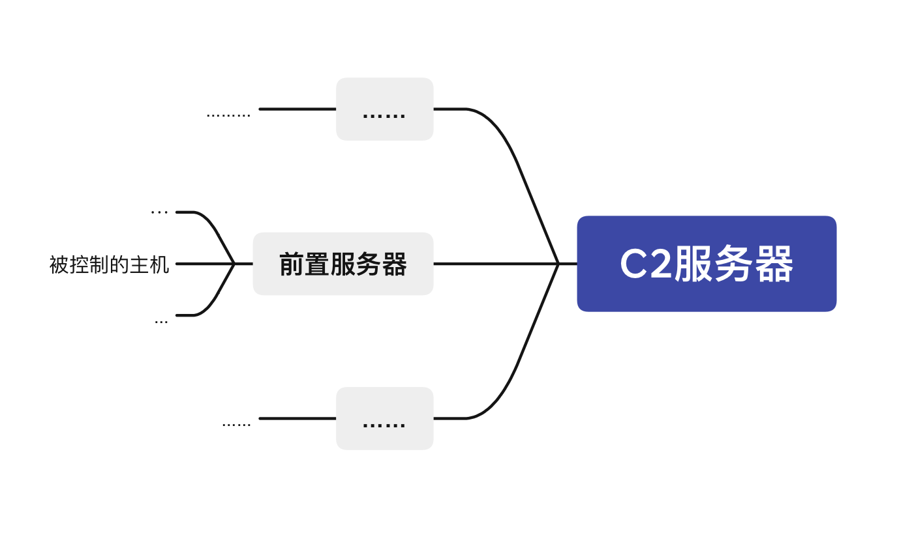

# 域前置技术

## 原理介绍

域前置，又译为域名幌子，是一种隐藏连接真实端点来规避互联网审查的技术。在应用层上运作时，域前置使用户能通过HTTPS连接到被屏蔽的服务，而表面上像在与另一个完全不同的站点通信。

**此技术的原理为在不同通信层使用不同的域名**。在明文的DNS请求和TLS服务器名称指示（SNI）中使用无害的域名来初始化连接、公布给审查者，而实际要连接的被封锁域名仅在创建加密的HTTPS连接后发出，使其不以明文暴露给网络审查者。

**该技术利用审查者通常很难区分被伪装流量与合法流量的特点，迫使审查者选择放行所有看似无害的流量，或者选择彻底封锁此域的流量。而彻底封锁可能带来显著的附加损害**。
这种举动在被封锁的站点与无害站点为同一个大型服务提供商时较为可行，例如由Google应用服务引擎（GAE）等提供的服务。
Google后于2018年4月禁用域前置，称这从未是Google有意支持的一项功能。亚马逊公司也在不久后决定停用CloudFront上的域前置支持，表示这已被视为违反AWS服务条款。有报道认为，Google和亚马逊做此决定的部分原因是来自俄罗斯政府的压力，因Telegram在当地使用这两家云服务提供商进行域前置活动。

## 原理解释

由图中可以看出该技术实现时被攻击主机和服务器的关系。

被攻击主机和一个前置服务器进行通信，然后前置服务器和C2服务器通信。**很像你在中间设置了一个代理服务器。不过此代理非彼代理**。**代理服务器的流量转发的目标是所有人都知道的，有没有这个代理，大家都知道这个流量最终是发给谁的**。

**而我们不希望除了我们以及目标前置服务器之外有第三者知道流量最终究竟发送给了谁**。这也是域前置技术的核心。

所以域前置技术一定需要用到`https`协议，因为它是安全的加密协议，除了最终与我们建立通信连接的目标前置服务器会解析出加密流量的明文内容，其他人都无法知道我们到底发送了什么。

### 为什么必须使用https协议

这里涉及到https和http的区别。我们简单做一个解释。

http协议是基于明文传输的一种通信协议。所以它途径的任何设备都知道他传输了什么信息，基于此，**它的流量包中涉及目标主机的内容只用被解析一次**。因为是明文，所以一次解析就把流量包的底摸清了，不一定知道你从哪来，但一定知道你最终到哪去，而且知道你干了什么。

https协议在http的基础上使用TLS/SSl协议进行数据加密。除了建立起连接后的目标机器，没有人能知道我们的通信内容。**于是关于通信目标的信息则相当于需要解析两**次。第一次是建立连接时，TLS协议需要先通过三次握手建立连接，然后才会发送真正要发送的数据包，这时路上途径的机器只能解析出来我们想要建立连接的前置服务器的信息；连接建立之后，会发送加密过的http数据，此时沿途的机器仍然只能知道这个数据包是发送给前置服务器的，而不知道这个数据包的实际内容，第二次解析则为目标前置服务器对加密数据解密之后解析明文数据，此时我们的目标前置服务器发现它解析出来的明文显示这个数据包其实最终是想发给我们真正的C2服务器的，于是它就把数据转发给了C2服务器。

综上，我们只能通过`https`协议来显示域前置，因为**域前置的根本目的就是在不让别人知道我们在干什么的基础上让别人不去怀疑我们隐藏自身**。而通过`https`协议去和常见的知名服务器建立连接，就可以轻易达到迷惑他人，混淆自身的目的。如果擅自采用其他的加密方式来实现域前置，虽然是让别人无法知道我们要干什么，但同样也让别人一眼就看出来我们与众不同，比如DNS加密隧道，虽然我不能解密你的数据，但我知道你有问题。

## 其他隐藏自身的技术

### CDN

其实域前置技术与cdn非常相像。

被攻击主机上只会有跟cdn的ip通信的流量，不会有跟真实C2服务器通信的流量，可以保护C2服务器的ip，但是域名还是会暴露。

技术实现重点：

+ 一个不备案的域名，否则这个方式毫无用处
+ 这种技术对http与https没有强制要求，都可以使用，而域前置技术要求是https

### 重定向技术

这种技术比较像穷人版本的CDN或者域前置技术。需要有两台vps，一台做重定向，一台是真正的C2服务器，而被攻击主机只与那台做重定向的机器通信，重定向机器只会转发来自beacon的特定流量到C2服务器，对于其他流量可以自定义设置处理方法，一般是采用重定向到一些高信誉域名上例如百度等。

可达到的效果：被攻击主机上只会有与重定向机器之间的流量，不会有与真实c2服务器的流量，重定向服务器会将非beacon的请求重定向到一些高信誉域名上，达到迷惑的目的，不过如果受害者ban掉了重定向机器的ip，对攻击者的损失也是很大的。

技术实现重点：

+ 两台服务器
+ 配置apache_rewrite
+ 配置malleable profile文件

### 与域前置技术的区别总结

+ cdn技术仅仅利用了cdn对http与https流量进行转发来达到的隐匿效果，可以隐藏ip不能隐藏域名。
+ 域前置技术高级一些，但是却基于https的，可以隐藏ip与域名，效果应该是最好的，只是因为现在不少的厂商已经禁止了域前置技术的存在，想用的话得自己去找还依旧允许域前置技术的厂商。
+ 重定向技术对运维人员迷惑效果还是不错的，但对于很专业的运维人员可能效果就没有那么好，而且配置也是最复杂的，如果被发现ban了自己的重定向机器，对于攻击队来说损失也不小，总的来说还是没有cdn的方法好用。
